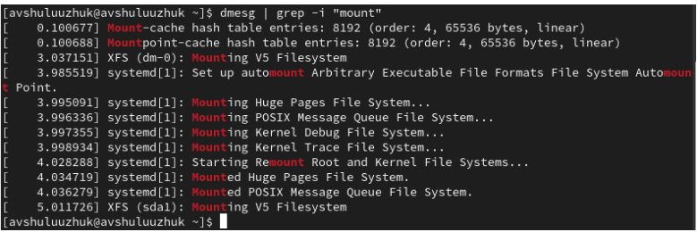

---
## Front matter
lang: ru-RU
title: Лабораторная работа № 2
subtitle: Установка и конфигурация операционной системы на виртуальную машину
author:
  - Шулуужук А. В.
institute:
  - Российский университет дружбы народов, Москва, Россия
date: 16 февраль 2024

## i18n babel
babel-lang: russian
babel-otherlangs: english

## Formatting pdf
toc: false
toc-title: Содержание
slide_level: 2
aspectratio: 169
section-titles: true
theme: metropolis
header-includes:
 - \metroset{progressbar=frametitle,sectionpage=progressbar,numbering=fraction}
 - '\makeatletter'
 - '\beamer@ignorenonframefalse'
 - '\makeatother'
---

## Цели и задачи

Целью данной работы является приобретение практических навыков установки операционной системы на виртуальную машину, настройки минимально необходимых для дальнейшей работы сервисов.

# Выполнение лабораторной работы

## Создание виртуальной машины

Создаем виртуальную машину: 

{#fig:001 width=70%}

##

Указываем размер основной памяти виртуальной машины – 4096 МБ и число процессоров - 2

{#fig:001 width=70%}

##

Задаем размер виртуального жесткого диска – 30 ГБ

{#fig:003 width=70%}

##

Создали виртуальную машину и запускаем образ ОС

{#fig:004 width=70%}

## Запуск виртуальной машины и образа диска домашней гостевой ОС

В качестве языка интерфейса выбираем английский язык

{#fig:005 width=70%}

##

Включим сетевое соединение и в качестве имени узла укажем user.localdomain, где вместо user указываем имя пользователя

{#fig:006 width=50%}

##

Установим пароль для root, задаем локального пользователя с правами
администратора и пароль для него

{#fig:007 width=50%}

##

{#fig:008 width=50%}

##

Начинаем установку ОС. Перезагружаем виртуальную машину

{#fig:009 width=70%}

##

Подключаем образ диска дополнений гостевой ОС

{#fig:010 width=70%}

## Домашнее задание

В терминале выполняем команду dmesg и используем его для поиска
dmegs | less

{#fig:011 width=50%}

## 

{#fig:012 width=70%}

##

Узнаем версию ядра Linux. Команда dmesg | grep -i “linux
version”

{#fig:013 width=70%}

## 

Частота процессора. Команда dmesg | grep -i “MHz

{#fig:014 width=70%}

## 

Модель процессора. Команда dmesg | grep -i “CPU0”

{#fig:015 width=70%}

##

Объем доступной оперативной памяти – 3,8 ГБ. Команда dmesg
| grep -i “memory”

{#fig:016 width=70%}

##

Тип обнаруженного гипервизора - KVM. Команда dmesg | grep
-i “hypervisor detected”

{#fig:017 width=70%}

##

Тип файловой системы корневого раздела – xfs. Используем
команду df -Th

{#fig:018 width=70%}

##

Последовательность монтирования файловых систем
Для этого используем команду dmesg | grep -i “mount”

{#fig:019 width=70%}

## Выводы

В ходе выполнения лабораторной работы были приобретены практические
навыки установки операционной системы на виртуальную машину и
настройка минимально необходимых для дальнейшей работы сервисов. Было
выполнено дополнительное задание, где в процессе мы узнавали требуемую
информацию
