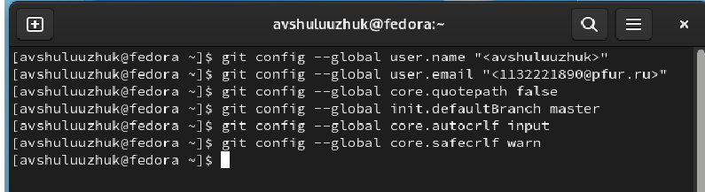
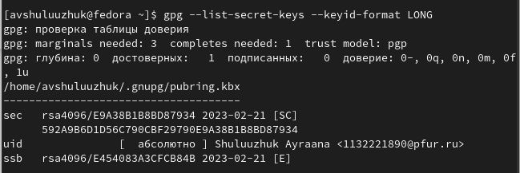
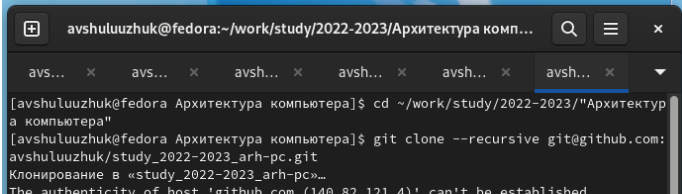

---
## Front matter
lang: ru-RU
title: Лабораторная работа № 2
subtitle: Операционные системы
author:
  - Шулуужук А. В.
institute:
  - Российский университет дружбы народов, Москва, Россия
date: 21 февраль 2023

## i18n babel
babel-lang: russian
babel-otherlangs: english

## Formatting pdf
toc: false
toc-title: Содержание
slide_level: 2
aspectratio: 169
section-titles: true
theme: metropolis
header-includes:
 - \metroset{progressbar=frametitle,sectionpage=progressbar,numbering=fraction}
 - '\makeatletter'
 - '\beamer@ignorenonframefalse'
 - '\makeatother'
---

## Цели и задачи

Изучить идеологию и применение средств контроля версий.

Освоить умения по работе с git.

# Выполнение лабораторной работы

## Установка программного обеспечения

Установка git, команда:
```
dnf install git
```
Установка gh:
```
dnf install gh

```
{width=70%}

## Базовая настрйка git.

Проделываем преварительную конфигурацию git. Введем
следующие команды, указав имя и email владельца репозитория

{width=70%}

## Создание SSH ключа

Для идентификации пользователя на сервере репозиториев необходимо сгенерировать ключи (приватный и открытый). Загрузим сгенерированный ключ в git 
```
ssh-keygen -C "Имя Фамилия <work@mail>
```
{width=70%}

{width=70%}

## Создание pgp ключа 

Генерируем ключ:
```
gpg --full-generate-key
```
{width=70%}

Cкопируем сгенерированный PGP ключ и добавляем в GitHub 
```
gpg --armor --export <PGP Fingerprint> | xclip -sel clip
```
{width=70%}

## Создание репозитория курса на основе шаблона. 

Используя репозиторий с шаблоном курса, создаем репозиторий курса «Операциооные системы» на веб-странице github.

Клонируем созданный репозиторий, ссылку для клонирования копируем на странице созданного репозитория:

{width=70%}

{width=70%}

## Настройка каталога курса

Переходим в каталог курса/ Удаляем лишние файлы 
```
rm package.json
```
Создаем необходимые каталоги:
```
echo arch-pc > COURSE
make
```
{width=70%}

## Отправление файлов на сервер

Отправляем файлы на сервер
```
git add .
git commit -am 'feat(main): make course structure'
git push
```
{width=70%}

## Выводы

Были приобретены практические навыки по работе с системой git. Изучена идеология и применение средств контроля версий.
Итог лабораторной работы: создание рабочего пространства и нового репозитория курса на основе шаблона, загрузка файлов на github.
