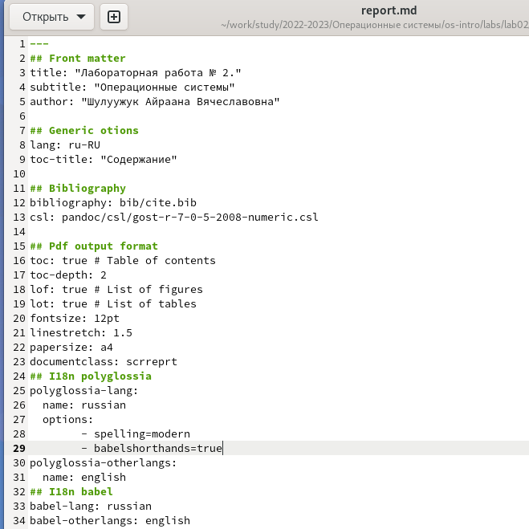
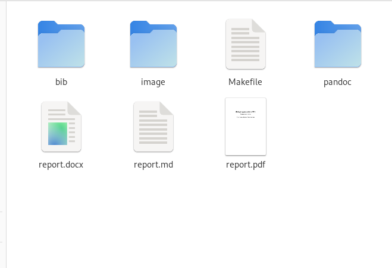

---
## Front matter
lang: ru-RU
title: Лабораторная работа № 3
subtitle: Операционные системы. Markdown
author:
  - Шулуужук А. В.
institute:
  - Российский университет дружбы народов, Москва, Россия

date: 24 февраля 2023

## i18n babel
babel-lang: russian
babel-otherlangs: english

## Formatting pdf
toc: false
toc-title: Содержание
slide_level: 2
aspectratio: 169
section-titles: true
theme: metropolis
header-includes:
 - \metroset{progressbar=frametitle,sectionpage=progressbar,numbering=fraction}
 - '\makeatletter'
 - '\beamer@ignorenonframefalse'
 - '\makeatother'
---

# Цели и задачи

Научиться оформлять отчёты с помощью легковесного языка разметки Markdown

## Задание

1. Сделайте отчёт по предыдущей лабораторной работе в формате Markdown.

2. В качестве отчёта просьба предоставить отчёты в 3 форматах: pdf, docx и md (в архиве,
поскольку он должен содержать скриншоты, Makefile и т.д)

# Выполнение лабораторной работы

1. Для обработки файлов в формате markdown, необходимо установить pandoc, pandoc-crossref, texlive

2. Открываем в текстовом редакторе отчет лабораторной работы 2 и редактируем шаблон

{width=50%}

## Выполнение лабораторной работы

3. Далее конвертируем файл в формате markdown в pdf и docx, используя команду make (в папке, где находится файл для компиляции)

4. Проверяем выполнение команды (создание файлов)

{width=60%}

# Выводы

В ходе выполнения лабораторной работы мы научились оформлять отчеты с помощью легковесного языка markdown, оформили отчеты лабораторной работы № 2 и № 3

