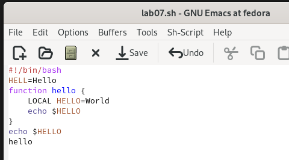
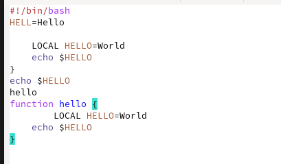
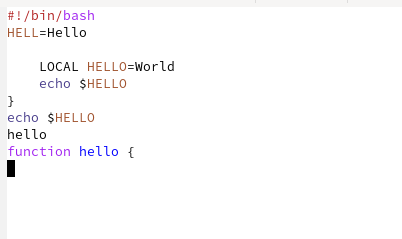
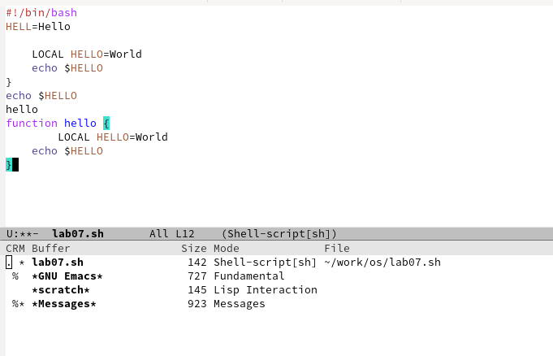
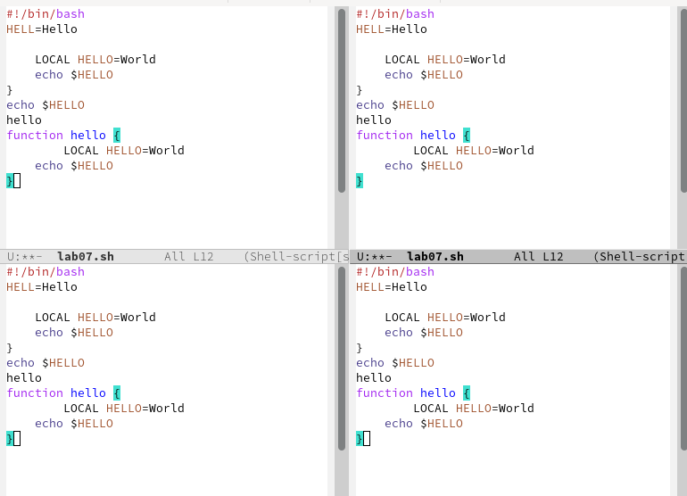
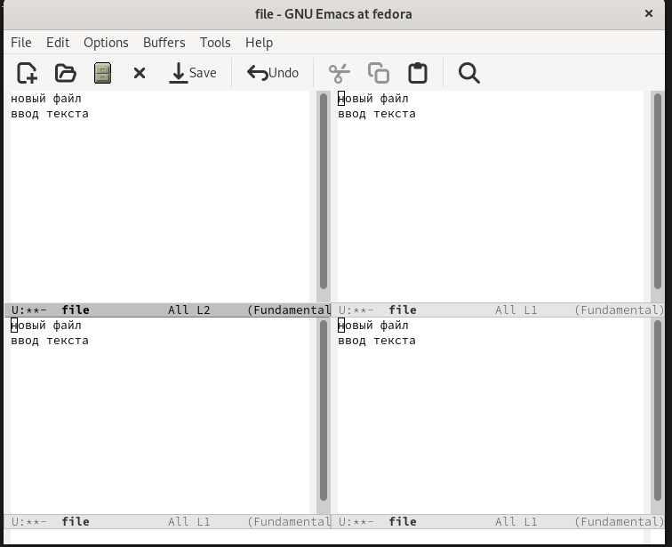
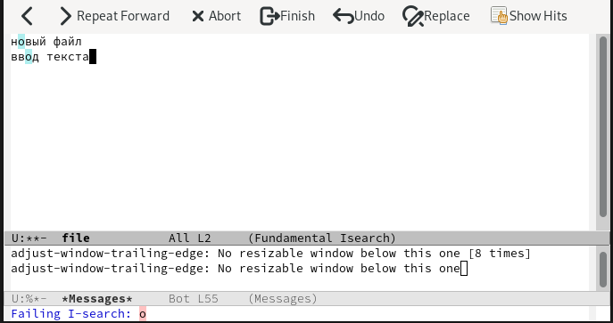

---
## Front matter
lang: ru-RU
title: Лабораторная работа № 9
subtitle: Текстовой редактор Emacs 
author:
  - Шулуужук Айраана Вячеславовна НПИбд-02-22
institute:
  - Российский университет дружбы народов, Москва, Россия
 
date: 2 апреля 2023 

## i18n babel
babel-lang: russian
babel-otherlangs: english

## Formatting pdf
toc: false
toc-title: Содержание
slide_level: 2
aspectratio: 169
section-titles: true
theme: metropolis
header-includes:
 - \metroset{progressbar=frametitle,sectionpage=progressbar,numbering=fraction}
 - '\makeatletter'
 - '\beamer@ignorenonframefalse'
 - '\makeatother'
---

## Докладчик

:::::::::::::: {.columns align=center}
::: {.column width="70%"}

  * Шулуужук Айраана Вячеславовна 
  * НПИбд-02-22
  * 1132221890
  * Российский университет дружбы народов

:::
::: {.column width="30%"}

:::
::::::::::::::
# Цели и задачи

Познакомиться с операционной системой Linux. Получить практические навыки работы с редактором Emacs.

# Выполнение лабораторной работы

##

Открываем emacs, создаем новый файл и введем следующий текст. Сохраняем данный файл

{width=70%}

## 

Проделаем с текстом процедкры редактирования 

Вырежем строку (С-k) и вставим его в конец файла 

{width=70%}

##

Выделяем некоторую область текста (C-space), копируем его и вставим в конец файла

{width=70%}

##

Вновь выделяем эту область и вырезаем его (C-w). Для отмены последнего действия используем комбинацию (С-/).

{width=70%}

## 

Выводим список активных буферов (С-х С-b)

{width=70%}

## 

Поделим фрейм на 4 части 

{width=60%}

## 

И в каждом окне откроем новый файл и введем произвольный текст 

{width=50%}

##

Переключимся в режим поиска и найдем несколько слов

{width=70%}

# Выводы

В ходе выполнения работы мы познакомились с операционной системой Linux. Получили практические навыки работы с редактором Emacs.

