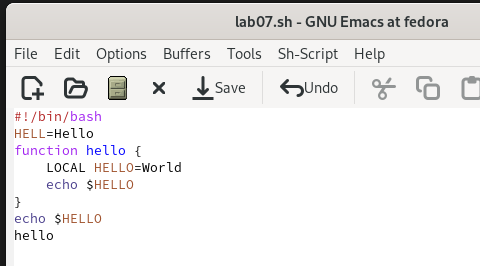
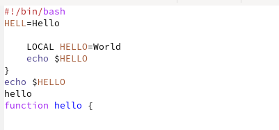
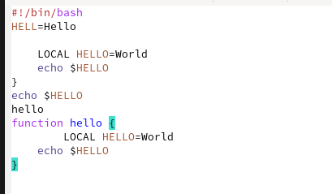
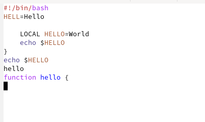
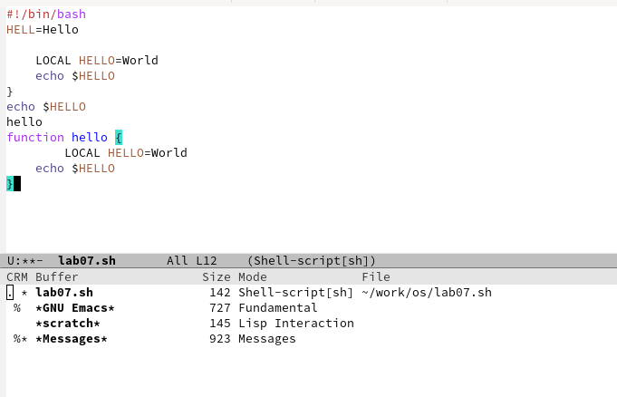
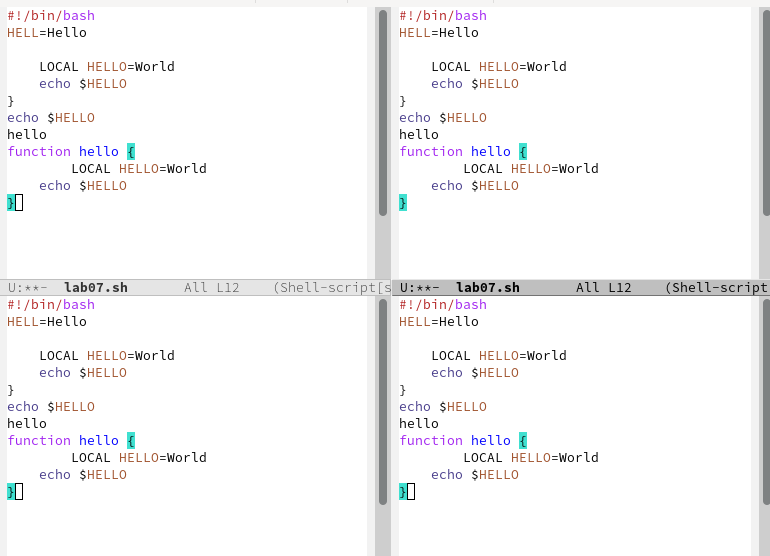
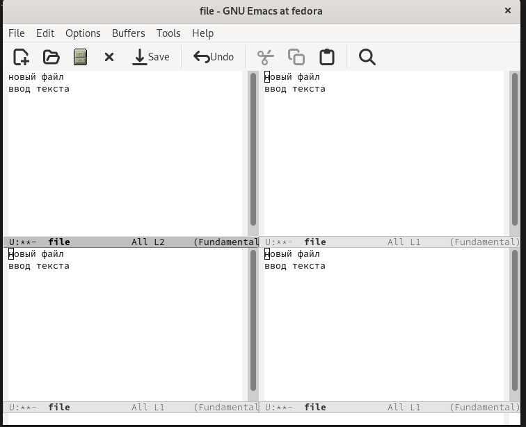
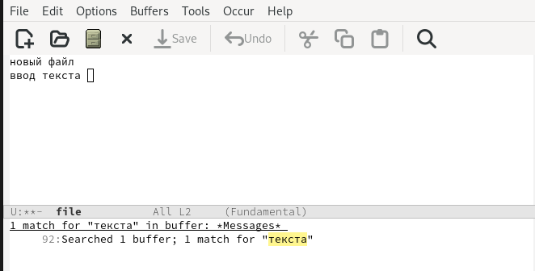

---
## Front matter
title: "Лабораторная работа № 9"
subtitle: "Текстовой редактор emacs"
author: "Шулуужук Айраана Вячеславовна НПИбд-02-22"

## Generic otions
lang: ru-RU
toc-title: "Содержание"

## Bibliography
bibliography: bib/cite.bib
csl: pandoc/csl/gost-r-7-0-5-2008-numeric.csl

## Pdf output format
toc: true # Table of contents
toc-depth: 2
lof: true # List of figures
lot: true # List of tables
fontsize: 12pt
linestretch: 1.5
papersize: a4
documentclass: scrreprt
## I18n polyglossia
polyglossia-lang:
  name: russian
  options:
	- spelling=modern
	- babelshorthands=true
polyglossia-otherlangs:
  name: english
## I18n babel
babel-lang: russian
babel-otherlangs: english
## Fonts
mainfont: PT Serif
romanfont: PT Serif
sansfont: PT Sans
monofont: PT Mono
mainfontoptions: Ligatures=TeX
romanfontoptions: Ligatures=TeX
sansfontoptions: Ligatures=TeX,Scale=MatchLowercase
monofontoptions: Scale=MatchLowercase,Scale=0.9
## Biblatex
biblatex: true
biblio-style: "gost-numeric"
biblatexoptions:
  - parentracker=true
  - backend=biber
  - hyperref=auto
  - language=auto
  - autolang=other*
  - citestyle=gost-numeric
## Pandoc-crossref LaTeX customization
figureTitle: "Рис."
tableTitle: "Таблица"
listingTitle: "Листинг"
lofTitle: "Список иллюстраций"
lotTitle: "Список таблиц"
lolTitle: "Листинги"
## Misc options
indent: true
header-includes:
  - \usepackage{indentfirst}
  - \usepackage{float} # keep figures where there are in the text
  - \floatplacement{figure}{H} # keep figures where there are in the text
---

# Цель работы

Познакомиться с операционной системой Linux. Получить практические навыки работы с редактором Emacs.

# Задание

1. Ознакомиться с теоретическим материалом.

2. Ознакомиться с редактором emacs.

3. Выполнить упражнения.

4. Ответить на контрольные вопросы.

# Теоретическое введение

Emacs представляет собой мощный экранный редактор текста, написанный на языке высокого уровня Elisp

## Основные термины Emacs

Определение 1. Буфер — объект, представляющий какой-либо текст.

Буфер может содержать что угодно, например, результаты компиляции программы или встроенные подсказки. Практически всё взаимодействие с пользователем, в том числе интерактивное, происходит посредством буферов.

Определение 2. Фрейм соответствует окну в обычном понимании этого слова. Каждый фрейм содержит область вывода и одно или несколько окон Emacs.

Определение 3. Окно — прямоугольная область фрейма, отображающая один из буферов.

Каждое окно имеет свою строку состояния, в которой выводится следующая информация: название буфера, его основной режим, изменялся ли текст буфера и как далеко вниз по буферу расположен курсор. Каждый буфер находится только в одном из возможных основных режимов. Существующие основные режимы включают режим Fundamental (наименее специализированный), режим Text, режим Lisp, режим С, режим Texinfo и другие. Под второстепенными режимами понимается список режимов, которые включены в данный момент в буфере выбранного окна.

Определение 4. Область вывода — одна или несколько строк внизу фрейма, в которой Emacs выводит различные сообщения, а также запрашивает подтверждения и дополнительную информацию от пользователя.

Определение 5. Минибуфер используется для ввода дополнительной информации и всегда отображается в области вывода.

Определение 6. Точка вставки — место вставки (удаления) данных в буфере.

# Выполнение лабораторной работы

1. Открываем emacs, создаем новый файл и введем следующий текст. Сохраняем данные файл (рис. @fig:001)

{#fig:001 width=70%}

2. Проделаем с текстом процедкры редактирования 

Вырежем строку (С-k) и вставим его в конец файла (рис. @fig:002)

{#fig:002 width=70%}

Выделяем некоторую область текста (C-space), копируем его и вставим в конец файла (рис. @fig:003)

{#fig:003 width=70%}

Вновь выделяем эту область и вырезаем его (C-w). Для отмены последнего действия используем комбинацию (С-/). (рис. @fig:004)

{#fig:004 width=70%}

3. Выводим список активных буферов (С-х С-b)  (рис. @fig:005)

{#fig:005 width=70%}

4. Поделим фрейм на 4 части (рис. @fig:006)

{#fig:006 width=70%}

И в каждом окне откроем новый файл и введем произвольный текст (рис. @fig:007)

{#fig:007 width=70%}

5. Переключимся в режим поиска и найдем несколько слов (рис. @fig:008) 

{#fig:008 width=70%}

Попробуем другой режим поиска слов (Alt-s o) (рис. @fig:009)

{#fig:009 width=70%}

# Выводы

В ходе выполнения работы мы познакомились с операционной системой Linux. Получили практические навыки работы с редактором Emacs.
