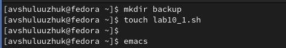
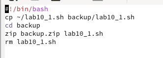
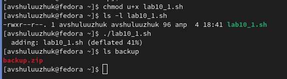
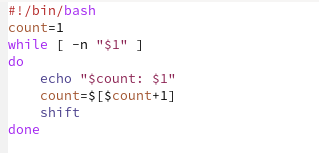
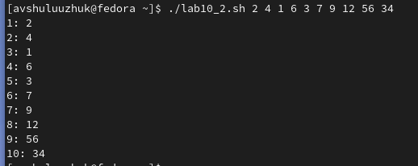
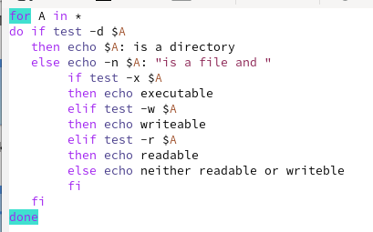
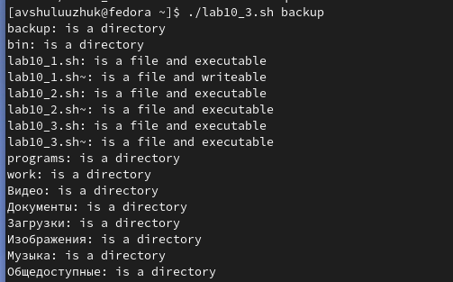
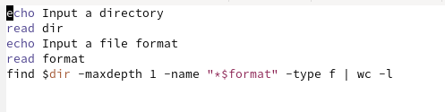
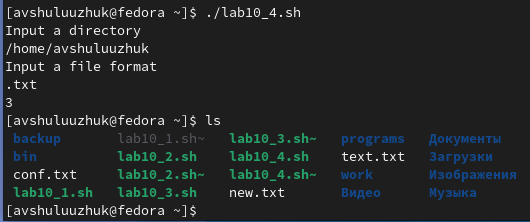

---
## Front matter
lang: ru-RU
title: Лабораторная работа № 10
subtitle: Программирование в командном процессоре ОС UNIX. Командные файлы
author:
  - Шулуужук Айраана Вячеславовна НПИбд-02-22
institute:
  - Российский университет дружбы народов, Москва, Россия
 
date: 4 апреля 2023 

## i18n babel
babel-lang: russian
babel-otherlangs: english

## Formatting pdf
toc: false
toc-title: Содержание
slide_level: 2
aspectratio: 169
section-titles: true
theme: metropolis
header-includes:
 - \metroset{progressbar=frametitle,sectionpage=progressbar,numbering=fraction}
 - '\makeatletter'
 - '\beamer@ignorenonframefalse'
 - '\makeatother'
---

## Докладчик

:::::::::::::: {.columns align=center}
::: {.column width="70%"}

  * Шулуужук Айраана Вячеславовна 
  * НПИбд-02-22
  * 1132221890
  * Российский университет дружбы народов

:::
::: {.column width="30%"}

:::
::::::::::::::
# Цели и задачи

Изучить основы программирования в оболочке ОС UNIX/Linux. Научиться писать небольшие командные файлы

# Выполнение лабораторной работы

## Выполнение лабораторной работы

Создадим каталог backup и файл lab10_1.sh. Откроем редактор emacs 

{width=70%}

## Выполнение лабораторной работы

Напишем скрипт, который при запуске будет делать резервную копию самого себя

{width=70%}

## Выполнение лабораторной работы

Присвоим данному файлу права на исполнение и запустим его 

{width=70%}

## Выполнение лабораторной работы

Создаем новый файл lab10_2.sh и напишем пример командного файла, обрабатывающее любое число аргументов командной строки

{width=70%}

## Выполнение лабораторной работы

Запустим следующий исполняемый файл и введем 10 или более произвольных чисел 

{width=70%}

## Выполнение лабораторной работы

Создаем новый файл lab10_3.sh для скрипта 3. Напишем командный файл, который воспроизводит аналог команды ls

{#fig:006 width=50%}

## Выполнение лабораторной работы

Запустим этот файл и просмотрим содержимое домашнего каталога

{width=60%}

## Выполнение лабораторной работы

В файле lab10_4 напишем скрипт, который получает в качестве аргумента командной строки формат файла  (.txt, .doc, .jpg, .pdf и т.д.) и вычисляет количество таких файлов в каталоге

{width=70%}

## Выполнение лабораторной работы

Запустим файл и просмотрим количество файлов формата .txt в домашнем каталоге

{width=70%}

# Выводы

В ходе выполнения работы мы познакомились с операционной системой Linux. Получили практические навыки работы с редактором Emacs.

