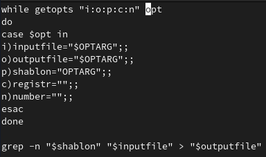
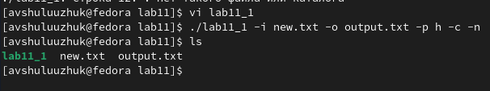
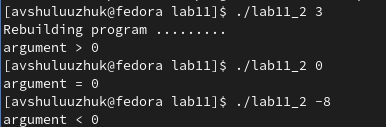
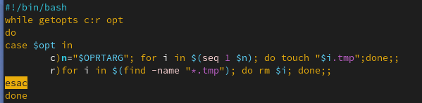
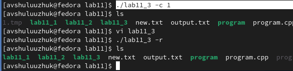
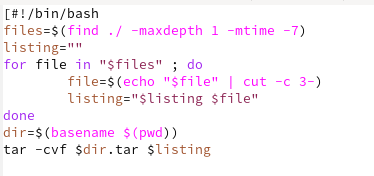
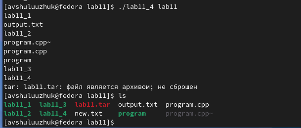

---
## Front matter
lang: ru-RU
title: Лабораторная работа № 11
subtitle: Программирование в командном процессоре ОС UNIX. Ветвления и циклы
author:
  - Шулуужук Айраана Вячеславовна НПИбд-02-22
institute:
  - Российский университет дружбы народов, Москва, Россия
 
date: 4 апреля 2023 

## i18n babel
babel-lang: russian
babel-otherlangs: english

## Formatting pdf
toc: false
toc-title: Содержание
slide_level: 2
aspectratio: 169
section-titles: true
theme: metropolis
header-includes:
 - \metroset{progressbar=frametitle,sectionpage=progressbar,numbering=fraction}
 - '\makeatletter'
 - '\beamer@ignorenonframefalse'
 - '\makeatother'
---

## Докладчик

:::::::::::::: {.columns align=center}
::: {.column width="70%"}

  * Шулуужук Айраана Вячеславовна 
  * НПИбд-02-22
  * 1132221890
  * Российский университет дружбы народов

:::
::: {.column width="30%"}

:::
::::::::::::::
# Цели и задачи

Изучить основы программирования в оболочке ОС UNIX. Научится писать более сложные командные файлы с использованием логических управляющих конструкций и циклов.

# Выполнение лабораторной работы

## Выполнение лабораторной работы

Используя команды getopts grep, напишем командный файл, который анализирует командную строку с ключами

{width=50%}

## Выполнение лабораторной работы

Скомпилируем данные файл и проверим его работу 

{width=70%}

## Выполнение лабораторной работы

Напишем на языке Си программу, которая вводит число и определяет, является ли оно больше нуля, меньше нуля или равно нулю 

{width=50%}

## Выполнение лабораторной работы

Нашишем командный файл который должен вызывать эту программу и, проанализировав с помощью команды $?, выдать сообщение о том, какое число было введено

{width=40%}

## Выполнение лабораторной работы

Проверим работу командного файла, используя число для сравнения в качестве аргумента

{width=70%}

## Выполнение лабораторной работы

Создаем новый файл lab11_3 для скрипта 3. Напишем командный файл, создающий указанное число файлов, пронумерованных последовательно от 1 до n и  удаляющий все созданные им файлы

{width=70%}

## Выполнение лабораторной работы

Запустим этот файл и создадим файл tmp, а также сразу удалим этот файл

{width=70%}

## Выполнение лабораторной работы

В файле lab11_4 напишем скрипт,  который с помощью команды tar запаковывает в архив все файлы в указанной директории. 

{width=70%}

## Выполнение лабораторной работы

Запустим файл и запакуем архив с файлами каталога lab11

{width=70%}

# Выводы

В ходе выполнения работы мы изучили основы программирования в оболочке ОС UNIX/Linux и научились писать более сложные командные файлы с использованием логических управляющих конструкций и циклов.

