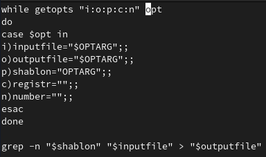
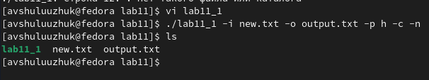
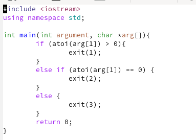
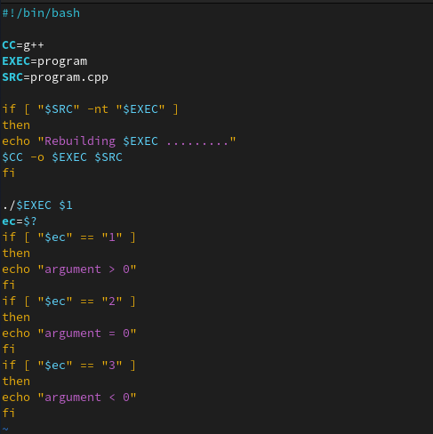
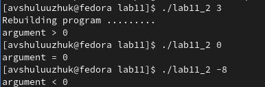
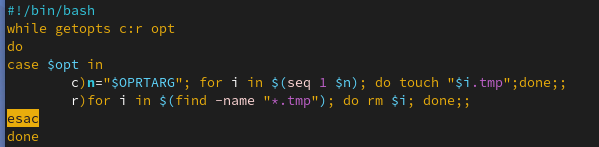
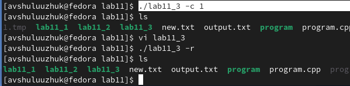
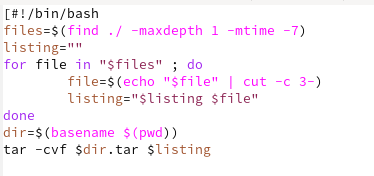
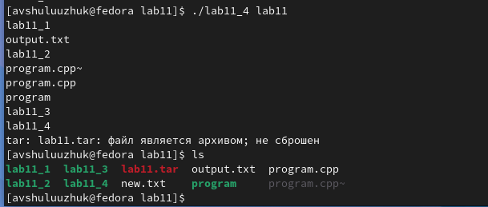

---
## Front matter
title: "Лабораторная работа № 11"
subtitle: "Программирование в командном процессоре ОС UNIX. Ветвления и циклы"
author: "Шулуужук Айраана Вячеславовна НПИбд-02-22"

## Generic otions
lang: ru-RU
toc-title: "Содержание"

## Bibliography
bibliography: bib/cite.bib
csl: pandoc/csl/gost-r-7-0-5-2008-numeric.csl

## Pdf output format
toc: true # Table of contents
toc-depth: 2
lof: true # List of figures
lot: true # List of tables
fontsize: 12pt
linestretch: 1.5
papersize: a4
documentclass: scrreprt
## I18n polyglossia
polyglossia-lang:
  name: russian
  options:
	- spelling=modern
	- babelshorthands=true
polyglossia-otherlangs:
  name: english
## I18n babel
babel-lang: russian
babel-otherlangs: english
## Fonts
mainfont: PT Serif
romanfont: PT Serif
sansfont: PT Sans
monofont: PT Mono
mainfontoptions: Ligatures=TeX
romanfontoptions: Ligatures=TeX
sansfontoptions: Ligatures=TeX,Scale=MatchLowercase
monofontoptions: Scale=MatchLowercase,Scale=0.9
## Biblatex
biblatex: true
biblio-style: "gost-numeric"
biblatexoptions:
  - parentracker=true
  - backend=biber
  - hyperref=auto
  - language=auto
  - autolang=other*
  - citestyle=gost-numeric
## Pandoc-crossref LaTeX customization
figureTitle: "Рис."
tableTitle: "Таблица"
listingTitle: "Листинг"
lofTitle: "Список иллюстраций"
lotTitle: "Список таблиц"
lolTitle: "Листинги"
## Misc options
indent: true
header-includes:
  - \usepackage{indentfirst}
  - \usepackage{float} # keep figures where there are in the text
  - \floatplacement{figure}{H} # keep figures where there are in the text
---

# Цель работы

Изучить основы программирования в оболочке ОС UNIX. Научится писать более сложные командные файлы с использованием логических управляющих конструкций и циклов.

# Задание

1. Используя команды getopts grep, написать командный файл, который анализирует
командную строку с ключами:

– -iinputfile — прочитать данные из указанного файла;
– -ooutputfile — вывести данные в указанный файл;
– -pшаблон — указать шаблон для поиска;
– -C — различать большие и малые буквы;
– -n — выдавать номера строк.

а затем ищет в указанном файле нужные строки, определяемые ключом -p.

2. Написать на языке Си программу, которая вводит число и определяет, является ли оно
больше нуля, меньше нуля или равно нулю. Затем программа завершается с помощью
функции exit(n), передавая информацию в о коде завершения в оболочку. Команд-
ный файл должен вызывать эту программу и, проанализировав с помощью команды
$?, выдать сообщение о том, какое число было введено.

3. Написать командный файл, создающий указанное число файлов, пронумерованных
последовательно от 1 до 𝑁 (например 1.tmp, 2.tmp, 3.tmp,4.tmp и т.д.). Число файлов,
которые необходимо создать, передаётся в аргументы командной строки. Этот же ко-
мандный файл должен уметь удалять все созданные им файлы (если они существуют).

4. Написать командный файл, который с помощью команды tar запаковывает в архив
все файлы в указанной директории. Модифицировать его так, чтобы запаковывались
только те файлы, которые были изменены менее недели тому назад (использовать
команду find).

# Теоретическое введение

## Командные процессоры (оболочки)

Командный процессор (командная оболочка, интерпретатор команд shell) — это про-
грамма, позволяющая пользователю взаимодействовать с операционной системой
компьютера. В операционных системах типа UNIX/Linux наиболее часто используются
следующие реализации командных оболочек:
– оболочка Борна (Bourne shell или sh) — стандартная командная оболочка UNIX/Linux,
содержащая базовый, но при этом полный набор функций;
– С-оболочка (или csh) — надстройка на оболочкой Борна, использующая С-подобный
синтаксис команд с возможностью сохранения истории выполнения команд;
– оболочка Корна (или ksh) — напоминает оболочку С, но операторы управления програм-
мой совместимы с операторами оболочки Борна;
– BASH — сокращение от Bourne Again Shell (опять оболочка Борна), в основе своей сов-
мещает свойства оболочек С и Корна (разработка компании Free Software Foundation).
POSIX (Portable Operating System Interface for Computer Environments) — набор стандартов
описания интерфейсов взаимодействия операционной системы и прикладных программ.
Стандарты POSIX разработаны комитетом IEEE (Institute of Electrical and Electronics
Engineers) для обеспечения совместимости различных UNIX/Linux-подобных опера-
ционных систем и переносимости прикладных программ на уровне исходного кода.
POSIX-совместимые оболочки разработаны на базе оболочки Корна.
Рассмотрим основные элементы программирования в оболочке bash. В других оболоч-
ках большинство команд будет совпадать с описанными ниже.

# Выполнение лабораторной работы

Используя команды getopts grep, напишем командный файл, который анализирует командную строку с ключами (рис. @fig:001)

{#fig:001 width=70%}

Скомпилируем данные файл и проверим его работу (рис. @fig:002)

{#fig:002 width=70%}

Напишем на языке Си программу, которая вводит число и определяет, является ли оно больше нуля, меньше нуля или равно нулю (рис. @fig:003)

{#fig:003 width=70%}

Нашишем командный файл который должен вызывать эту программу и, проанализировав с помощью команды $?, выдать сообщение о том, какое число было введено.(рис. @fig:004)

{#fig:004 width=70%}

Проверим работу командного файла, используя число для сравнения в качестве аргумента (рис. @fig:005)

{#fig:005 width=70%}

Создаем новый файл lab11_3 для скрипта 3. Напишем командный файл, создающий указанное число файлов, пронумерованных последовательно от 1 до n и  удаляющий все созданные им файлы (рис. @fig:006)

{#fig:006 width=70%}

Запустим этот файл и создадим файл tmp, а также сразу удалим этот файл (рис. @fig:007)

{#fig:007 width=70%}

В файле lab11_4 напишем скрипт,  который с помощью команды tar запаковывает в архив все файлы в указанной директории.  (рис. @fig:008) 

{#fig:008 width=70%}

Запустим файл и запакуем архив с файлами каталога lab11 (рис. @fig:009)

{#fig:009 width=70%}

# Выводы

В ходе выполнения работы мы изучили основы программирования в оболочке ОС UNIX/Linux и научились писать более сложные командные файлы с использованием логических управляющих конструкций и циклов.
