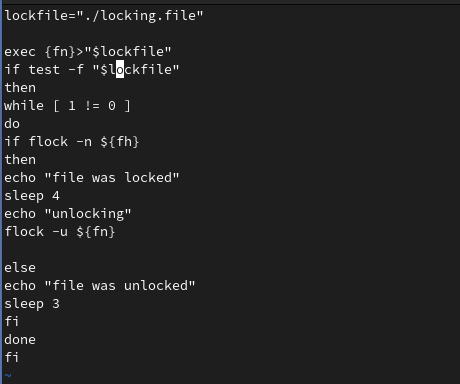
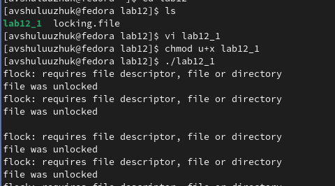
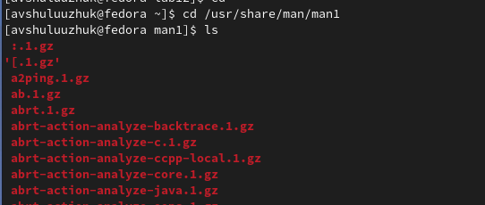
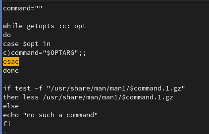
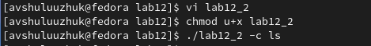
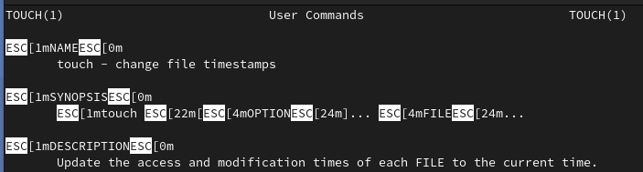
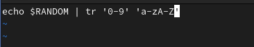
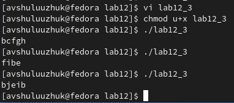

---
## Front matter
lang: ru-RU
title: Лабораторная работа № 12
subtitle: Программирование в командном процессоре ОС UNIX. Расширенное программирование
author:
  - Шулуужук Айраана Вячеславовна НПИбд-02-22
institute:
  - Российский университет дружбы народов, Москва, Россия
 
date: 8 апреля 2023 

## i18n babel
babel-lang: russian
babel-otherlangs: english

## Formatting pdf
toc: false
toc-title: Содержание
slide_level: 2
aspectratio: 169
section-titles: true
theme: metropolis
header-includes:
 - \metroset{progressbar=frametitle,sectionpage=progressbar,numbering=fraction}
 - '\makeatletter'
 - '\beamer@ignorenonframefalse'
 - '\makeatother'
---

## Докладчик

:::::::::::::: {.columns align=center}
::: {.column width="70%"}

  * Шулуужук Айраана Вячеславовна 
  * НПИбд-02-22
  * 1132221890
  * Российский университет дружбы народов

:::
::: {.column width="30%"}

:::
::::::::::::::
# Цели и задачи

Изучить основы программирования в оболочке ОС UNIX. Научится писать более сложные командные файлы с использованием логических управляющих конструкций и циклов.

# Выполнение лабораторной работы

## Выполнение лабораторной работы

Напишем командный файл, реализующий упрощенный механизм семафоров 

{width=40%}

## Выполнение лабораторной работы

Скомпилируем данный файл и проверим его работу

{width=60%}

## Выполнение лабораторной работы

Изучим содержимое каталога  /usr/share/man/man1, в котором находятся фрхивы текстовых файлов, содержащих справку о командах.

{width=70%}

## Выполнение лабораторной работы

Далее реализуем команду man с помощью командного файла

{width=50%}

## Выполнение лабораторной работы

Проверим работу командного файла, используя нужную опцию и команду в качестве аргумента

{width=70%}

## Выполнение лабораторной работы

{width=70%}

## Выполнение лабораторной работы

Используя встроенную переменную $RANDOM, напишем командный файл, генерирующий случайную последовательность букв латинского алфавита.

{width=70%}

## Выполнение лабораторной работы

Запустим данный командный файл и в результате будет выводится несколько букв латинского алфавита рандомно 

{width=70%}

# Выводы

В ходе выполнения работы мы изучили основы программирования в оболочке ОС UNIX/Linux и научились писать более сложные командные файлы с использованием логических управляющих конструкций и циклов.

