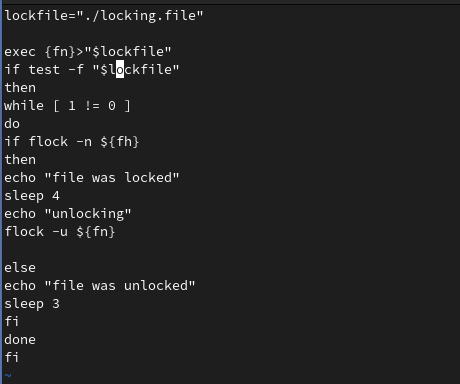
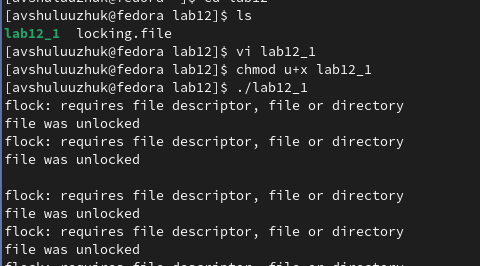
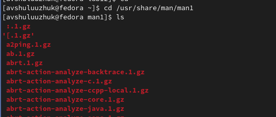
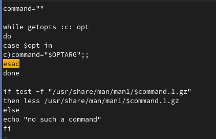
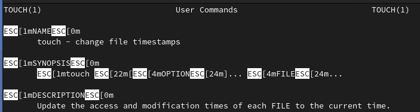
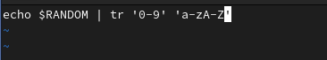
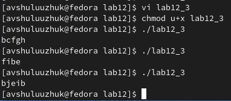

---
## Front matter
title: "Лабораторная работа № 12"
subtitle: "Программирование в командном процессоре ОС UNIX. Расширенное программирование"
author: "Шулуужук Айраана Вячеславовна НПИбд-02-22"

## Generic otions
lang: ru-RU
toc-title: "Содержание"

## Bibliography
bibliography: bib/cite.bib
csl: pandoc/csl/gost-r-7-0-5-2008-numeric.csl

## Pdf output format
toc: true # Table of contents
toc-depth: 2
lof: true # List of figures
lot: true # List of tables
fontsize: 12pt
linestretch: 1.5
papersize: a4
documentclass: scrreprt
## I18n polyglossia
polyglossia-lang:
  name: russian
  options:
	- spelling=modern
	- babelshorthands=true
polyglossia-otherlangs:
  name: english
## I18n babel
babel-lang: russian
babel-otherlangs: english
## Fonts
mainfont: PT Serif
romanfont: PT Serif
sansfont: PT Sans
monofont: PT Mono
mainfontoptions: Ligatures=TeX
romanfontoptions: Ligatures=TeX
sansfontoptions: Ligatures=TeX,Scale=MatchLowercase
monofontoptions: Scale=MatchLowercase,Scale=0.9
## Biblatex
biblatex: true
biblio-style: "gost-numeric"
biblatexoptions:
  - parentracker=true
  - backend=biber
  - hyperref=auto
  - language=auto
  - autolang=other*
  - citestyle=gost-numeric
## Pandoc-crossref LaTeX customization
figureTitle: "Рис."
tableTitle: "Таблица"
listingTitle: "Листинг"
lofTitle: "Список иллюстраций"
lotTitle: "Список таблиц"
lolTitle: "Листинги"
## Misc options
indent: true
header-includes:
  - \usepackage{indentfirst}
  - \usepackage{float} # keep figures where there are in the text
  - \floatplacement{figure}{H} # keep figures where there are in the text
---

# Цель работы

Изучить основы программирования в оболочке ОС UNIX. Научится писать более сложные командные файлы с использованием логических управляющих конструкций и циклов.

# Задание

1. Написать командный файл, реализующий упрощённый механизм семафоров. Ко-
мандный файл должен в течение некоторого времени t1 дожидаться освобождения
ресурса, выдавая об этом сообщение, а дождавшись его освобождения, использовать
его в течение некоторого времени t2<>t1, также выдавая информацию о том, что
ресурс используется соответствующим командным файлом (процессом). Запустить
командный файл в одном виртуальном терминале в фоновом режиме, перенаправив
его вывод в другой (> /dev/tty#, где # — номер терминала куда перенаправляется
вывод), в котором также запущен этот файл, но не фоновом, а в привилегированном
режиме. Доработать программу так, чтобы имелась возможность взаимодействия трёх
и более процессов.

2. Реализовать команду man с помощью командного файла. Изучите содержимое ката-
лога /usr/share/man/man1. В нем находятся архивы текстовых файлов, содержащих
справку по большинству установленных в системе программ и команд. Каждый архив
можно открыть командой less сразу же просмотрев содержимое справки. Командный
файл должен получать в виде аргумента командной строки название команды и в виде
результата выдавать справку об этой команде или сообщение об отсутствии справки,
если соответствующего файла нет в каталоге man1.

3. Используя встроенную переменную $RANDOM, напишите командный файл, генерирую-
щий случайную последовательность букв латинского алфавита. Учтите, что $RANDOM
выдаёт псевдослучайные числа в диапазоне от 0 до 32767.

# Теоретическое введение

## Командные процессоры (оболочки)

Командный процессор (командная оболочка, интерпретатор команд shell) — это про-
грамма, позволяющая пользователю взаимодействовать с операционной системой
компьютера. В операционных системах типа UNIX/Linux наиболее часто используются
следующие реализации командных оболочек:
– оболочка Борна (Bourne shell или sh) — стандартная командная оболочка UNIX/Linux,
содержащая базовый, но при этом полный набор функций;
– С-оболочка (или csh) — надстройка на оболочкой Борна, использующая С-подобный
синтаксис команд с возможностью сохранения истории выполнения команд;
– оболочка Корна (или ksh) — напоминает оболочку С, но операторы управления програм-
мой совместимы с операторами оболочки Борна;
– BASH — сокращение от Bourne Again Shell (опять оболочка Борна), в основе своей сов-
мещает свойства оболочек С и Корна (разработка компании Free Software Foundation).
POSIX (Portable Operating System Interface for Computer Environments) — набор стандартов
описания интерфейсов взаимодействия операционной системы и прикладных программ.
Стандарты POSIX разработаны комитетом IEEE (Institute of Electrical and Electronics
Engineers) для обеспечения совместимости различных UNIX/Linux-подобных опера-
ционных систем и переносимости прикладных программ на уровне исходного кода.
POSIX-совместимые оболочки разработаны на базе оболочки Корна.
Рассмотрим основные элементы программирования в оболочке bash.

# Выполнение лабораторной работы

Напишем командный файл, реализующий упрощенный механизм семафоров (рис. @fig:001)

{#fig:001 width=70%}

Скомпилируем данный файл и проверим его работу (рис. @fig:002)

{#fig:002 width=70%}

Изучим содержимое каталога  /usr/share/man/man1, в котором находятся фрхивы текстовых файлов, содержащих справку о командах. (рис. @fig:003)

{#fig:003 width=70%}

Далее реализуем команду man с помощью командного файла (рис. @fig:004)

{#fig:004 width=70%}

Проверим работу командного файла, используя нужную опцию и команду в качестве аргумента (рис. @fig:005) (рис. @fig:006)

{#fig:005 width=70%}

{#fig:006 width=70%}

Используя встроенную переменную $RANDOM, напишем командный файл, генерирующий случайную последовательность букв латинского алфавита. (рис. @fig:007)

{#fig:007 width=70%}

Запустим данный командный файл и в результате будет выводится несколько букв латинского алфавита рандомно (рис. @fig:008) 

{#fig:008 width=70%}

# Выводы

В ходе выполнения работы мы изучили основы программирования в оболочке ОС UNIX/Linux и научились писать более сложные командные файлы с использованием логических управляющих конструкций и циклов.
