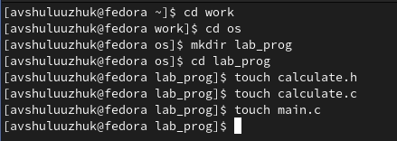
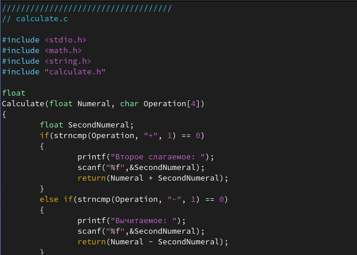
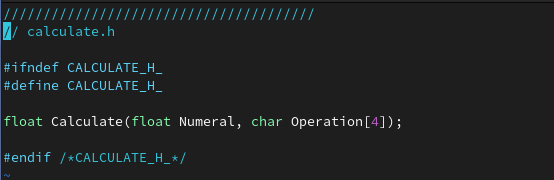
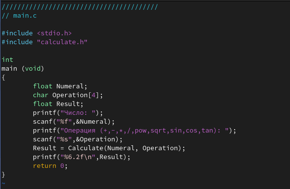
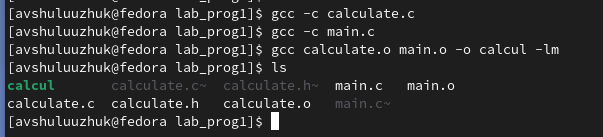
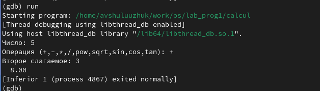
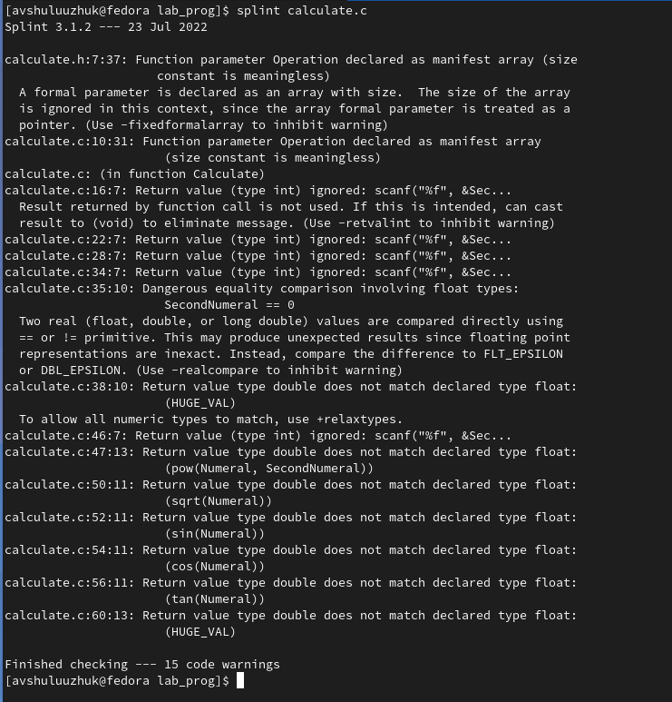
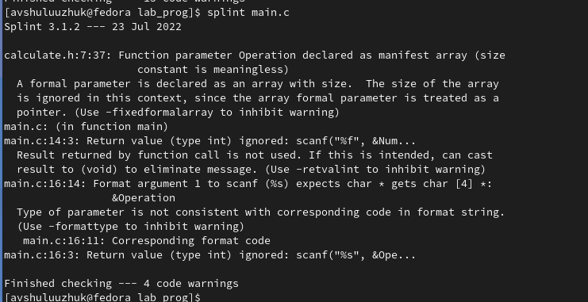

---
## Front matter
lang: ru-RU
title: Лабораторная работа № 13
subtitle: Средства, применяемые при разработке программного обеспечения в ОС типа UNIX/Linux
author:
  - Шулуужук Айраана Вячеславовна НПИбд-02-22
institute:
  - Российский университет дружбы народов, Москва, Россия
 
date: 8 апреля 2023 

## i18n babel
babel-lang: russian
babel-otherlangs: english

## Formatting pdf
toc: false
toc-title: Содержание
slide_level: 2
aspectratio: 169
section-titles: true
theme: metropolis
header-includes:
 - \metroset{progressbar=frametitle,sectionpage=progressbar,numbering=fraction}
 - '\makeatletter'
 - '\beamer@ignorenonframefalse'
 - '\makeatother'
---

## Докладчик

:::::::::::::: {.columns align=center}
::: {.column width="70%"}

  * Шулуужук Айраана Вячеславовна 
  * НПИбд-02-22
  * 1132221890
  * Российский университет дружбы народов

:::
::: {.column width="30%"}

:::
::::::::::::::
# Цели и задачи

Приобрести простейшие навыки разработки, анализа, тестирования и отладки приложений в ОС типа UNIX/Linux на примере создания на языке программирования С калькулятора с простейшими функциями.

# Выполнение лабораторной работы

## Выполнение лабораторной работы

Создадим нужный каталог и необходимые файлы

{width=70%}

## Выполнение лабораторной работы

Внесем тексты программ в файлы

{width=40%}

## Выполнение лабораторной работы

{width=70%}

## Выполнение лабораторной работы

{width=70%}

## Выполнение лабораторной работы

Выполним компиляцию программы посредством gcc 

{width=70%}

## Выполнение лабораторной работы

Создадим файл Makefile со следующим содержащим

{width=70%}

## Выполнение лабораторной работы

С помощью gdb выполним отладку программы calcul. Запустим отладчик GDB, загрузив в него программу для отладки и введем команду run 

{width=70%}

## Выполнение лабораторной работы

С помощью утилиты splint проанализируем коды файлов calculate.c и main.c 

{width=40%}

## Выполнение лабораторной работы

{width=70%}

# Выводы

В ходе выполнения работы мы приобрели простейшие навыки разработки, анализа, тестирования и отладки приложений в ОС типа UNIX/Linux на примере создания на языке программирования С калькулятора с простейшими функциями.

