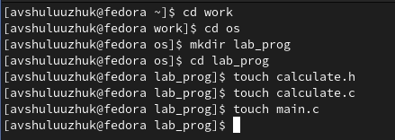
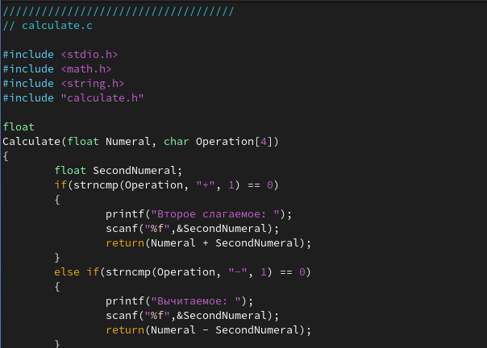
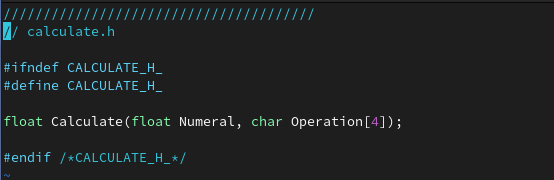
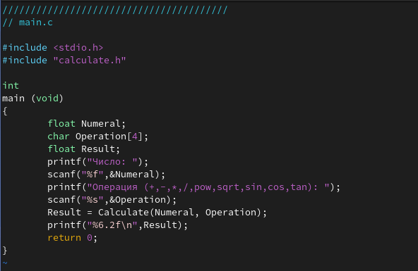
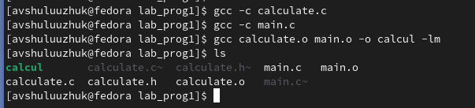
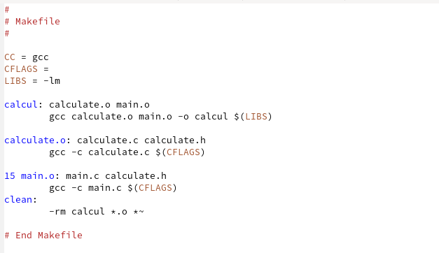
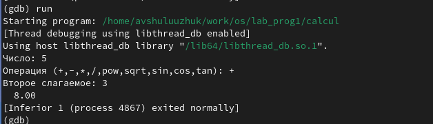
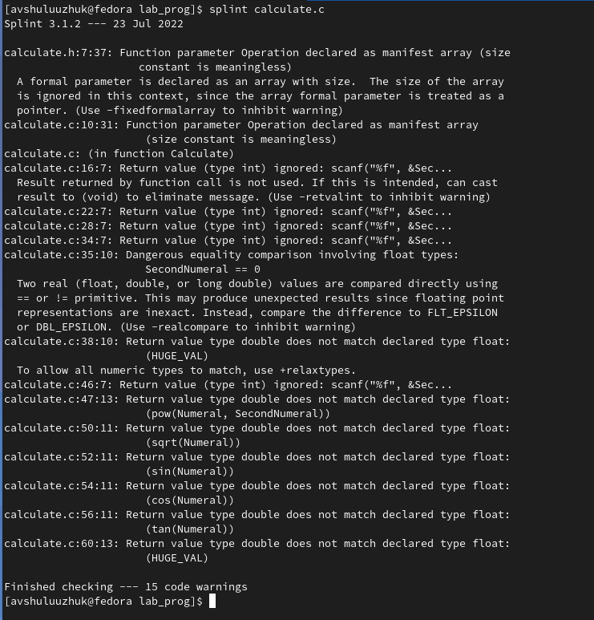
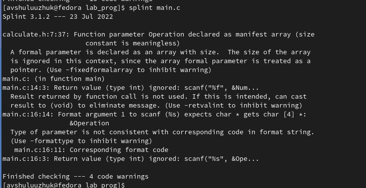

---
## Front matter
title: "Лабораторная работа № 13"
subtitle: "Средства, применяемые при разработке программного обеспечения в ОС типа UNIX/Linux"
author: "Шулуужук Айраана Вячеславовна НПИбд-02-22"

## Generic otions
lang: ru-RU
toc-title: "Содержание"

## Bibliography
bibliography: bib/cite.bib
csl: pandoc/csl/gost-r-7-0-5-2008-numeric.csl

## Pdf output format
toc: true # Table of contents
toc-depth: 2
lof: true # List of figures
lot: true # List of tables
fontsize: 12pt
linestretch: 1.5
papersize: a4
documentclass: scrreprt
## I18n polyglossia
polyglossia-lang:
  name: russian
  options:
	- spelling=modern
	- babelshorthands=true
polyglossia-otherlangs:
  name: english
## I18n babel
babel-lang: russian
babel-otherlangs: english
## Fonts
mainfont: PT Serif
romanfont: PT Serif
sansfont: PT Sans
monofont: PT Mono
mainfontoptions: Ligatures=TeX
romanfontoptions: Ligatures=TeX
sansfontoptions: Ligatures=TeX,Scale=MatchLowercase
monofontoptions: Scale=MatchLowercase,Scale=0.9
## Biblatex
biblatex: true
biblio-style: "gost-numeric"
biblatexoptions:
  - parentracker=true
  - backend=biber
  - hyperref=auto
  - language=auto
  - autolang=other*
  - citestyle=gost-numeric
## Pandoc-crossref LaTeX customization
figureTitle: "Рис."
tableTitle: "Таблица"
listingTitle: "Листинг"
lofTitle: "Список иллюстраций"
lotTitle: "Список таблиц"
lolTitle: "Листинги"
## Misc options
indent: true
header-includes:
  - \usepackage{indentfirst}
  - \usepackage{float} # keep figures where there are in the text
  - \floatplacement{figure}{H} # keep figures where there are in the text
---

# Цель работы

Приобрести простейшие навыки разработки, анализа, тестирования и отладки приложений в ОС типа UNIX/Linux на примере создания на языке программирования С калькулятора с простейшими функциями.

# Задание

1. Написать командный файл, реализующий упрощённый механизм семафоров. Ко-
мандный файл должен в течение некоторого времени t1 дожидаться освобождения
ресурса, выдавая об этом сообщение, а дождавшись его освобождения, использовать
его в течение некоторого времени t2<>t1, также выдавая информацию о том, что
ресурс используется соответствующим командным файлом (процессом). Запустить
командный файл в одном виртуальном терминале в фоновом режиме, перенаправив
его вывод в другой (> /dev/tty#, где # — номер терминала куда перенаправляется
вывод), в котором также запущен этот файл, но не фоновом, а в привилегированном
режиме. Доработать программу так, чтобы имелась возможность взаимодействия трёх
и более процессов.

2. Реализовать команду man с помощью командного файла. Изучите содержимое ката-
лога /usr/share/man/man1. В нем находятся архивы текстовых файлов, содержащих
справку по большинству установленных в системе программ и команд. Каждый архив
можно открыть командой less сразу же просмотрев содержимое справки. Командный
файл должен получать в виде аргумента командной строки название команды и в виде
результата выдавать справку об этой команде или сообщение об отсутствии справки,
если соответствующего файла нет в каталоге man1.

3. Используя встроенную переменную $RANDOM, напишите командный файл, генерирую-
щий случайную последовательность букв латинского алфавита. Учтите, что $RANDOM
выдаёт псевдослучайные числа в диапазоне от 0 до 32767.

# Теоретическое введение

## Этапы разработки приложений

Процесс разработки программного обеспечения обычно разделяется на следующие
этапы:

– планирование, включающее сбор и анализ требований к функционалу и другим ха-
рактеристикам разрабатываемого приложения;

– проектирование, включающее в себя разработку базовых алгоритмов и спецификаций,
определение языка программирования;

– непосредственная разработка приложения:

– кодирование — по сути создание исходного текста программы (возможно
в нескольких вариантах);

– анализ разработанного кода;

– сборка, компиляция и разработка исполняемого модуля;

– тестирование и отладка, сохранение произведённых изменений;

– документирование.

Для создания исходного текста программы разработчик может воспользоваться любым
удобным для него редактором текста: vi, vim, mceditor, emacs, geany и др.
После завершения написания исходного кода программы (возможно состоящей из
нескольких файлов), необходимо её скомпилировать и получить исполняемый модуль.

# Выполнение лабораторной работы

Создадим нужный каталог и необходимые файлы  (рис. @fig:001)

{#fig:001 width=70%}

Внесем тексты программ в файлы (рис. @fig:002) (рис. @fig:003) (рис. @fig:004)

{#fig:002 width=70%}

{#fig:003 width=70%}

{#fig:004 width=70%}

Выполним компиляцию программы посредством gcc (рис. @fig:005) 

{#fig:005 width=70%}

Создадим файл Makefile со следующим содержащим (рис. @fig:006)

{#fig:006 width=70%}

С помощью gdb выполним отладку программы calcul. Запустим отладчик GDB, загрузив в него программу для отладки и введем команду run (рис. @fig:007)

{#fig:007 width=70%}

С помощью утилиты splint проанализируем коды файлов calculate.c и main.c (рис. @fig:008) (рис. @fig:009) 

{#fig:008 width=70%}

{#fig:009 width=70%}

# Выводы

В ходе выполнения работы мы приобрели простейшие навыки разработки, анализа, тестирования и отладки приложений в ОС типа UNIX/Linux на примере создания на языке программирования С калькулятора с простейшими функциями.
