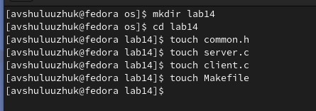
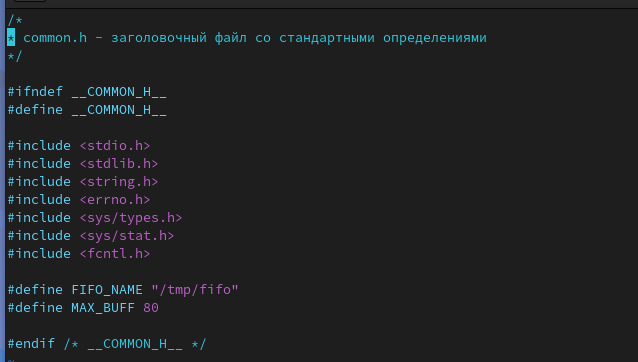
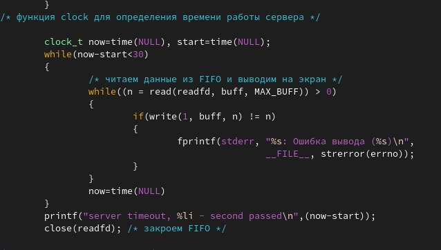
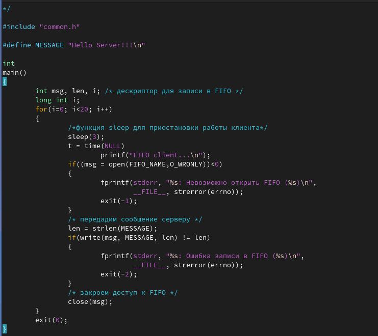
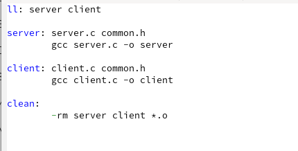
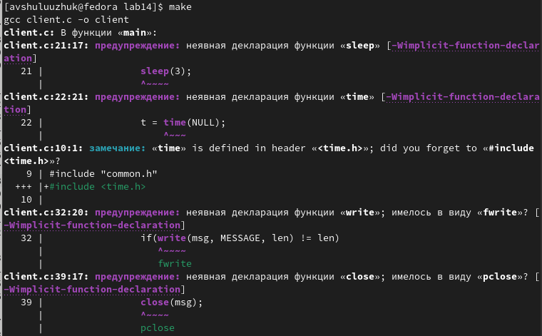
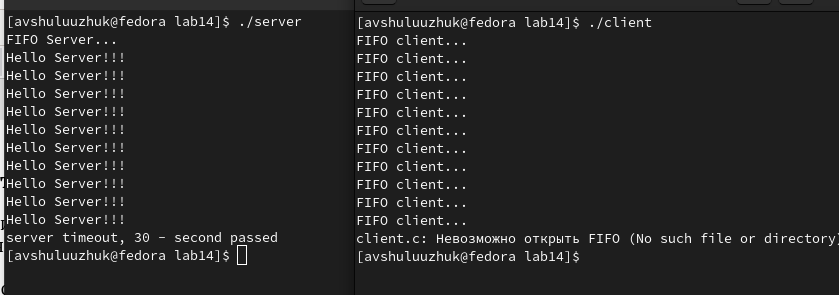

---
## Front matter
lang: ru-RU
title: Лабораторная работа № 14
subtitle: Именованные каналы
author:
  - Шулуужук Айраана Вячеславовна НПИбд-02-22
institute:
  - Российский университет дружбы народов, Москва, Россия
 
date: 8 апреля 2023 

## i18n babel
babel-lang: russian
babel-otherlangs: english

## Formatting pdf
toc: false
toc-title: Содержание
slide_level: 2
aspectratio: 169
section-titles: true
theme: metropolis
header-includes:
 - \metroset{progressbar=frametitle,sectionpage=progressbar,numbering=fraction}
 - '\makeatletter'
 - '\beamer@ignorenonframefalse'
 - '\makeatother'
---

## Докладчик

:::::::::::::: {.columns align=center}
::: {.column width="70%"}

  * Шулуужук Айраана Вячеславовна 
  * НПИбд-02-22
  * 1132221890
  * Российский университет дружбы народов

:::
::: {.column width="30%"}

:::
::::::::::::::
# Цели и задачи

Приобретение практических навыков работы с именованными каналами.

# Выполнение лабораторной работы

## Выполнение лабораторной работы

Создадим нужный каталог и необходимые файлы  

{width=70%}

## Выполнение лабораторной работы

Внесем тексты программ в файлы 

{width=70%}

## Выполнение лабораторной работы

В файле server.c введем дополнительную функцию clock для определения времени работы сервера 

{width=60%}

## Выполнение лабораторной работы

В файле client.c введем некоторые изменения, клиенты передают текущее время с некоторой периодичностью (например, раз в пять секунд). Используем функцию sleep 

{width=40%}

## Выполнение лабораторной работы

Создаем файл Makefile 

{width=70%}

## Выполнение лабораторной работы

Скомпилируем программу, используюя Makefile 

{width=60%}

## Выполнение лабораторной работы

Запустим командные файлы server и client 

{width=70%}

# Выводы

В ходе выполнения работы мы приобрели практические навыки работы с именованными каналами.

