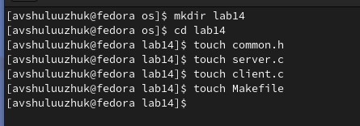
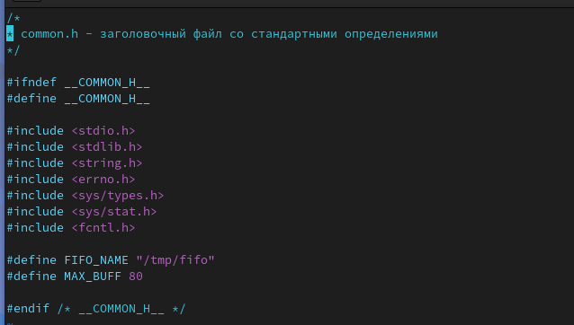
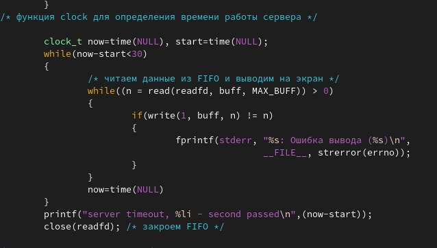
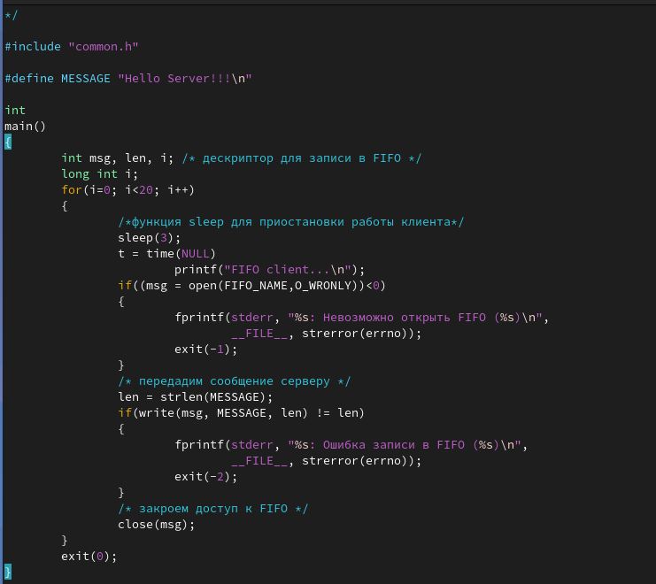
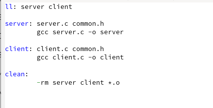
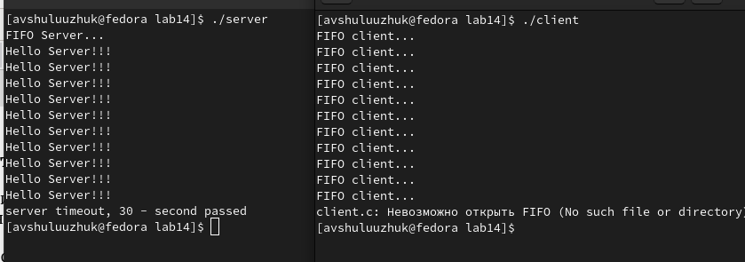

---
## Front matter
title: "Лабораторная работа № 14"
subtitle: "Именованные каналы"
author: "Шулуужук Айраана Вячеславовна НПИбд-02-22"

## Generic otions
lang: ru-RU
toc-title: "Содержание"

## Bibliography
bibliography: bib/cite.bib
csl: pandoc/csl/gost-r-7-0-5-2008-numeric.csl

## Pdf output format
toc: true # Table of contents
toc-depth: 2
lof: true # List of figures
lot: true # List of tables
fontsize: 12pt
linestretch: 1.5
papersize: a4
documentclass: scrreprt
## I18n polyglossia
polyglossia-lang:
  name: russian
  options:
	- spelling=modern
	- babelshorthands=true
polyglossia-otherlangs:
  name: english
## I18n babel
babel-lang: russian
babel-otherlangs: english
## Fonts
mainfont: PT Serif
romanfont: PT Serif
sansfont: PT Sans
monofont: PT Mono
mainfontoptions: Ligatures=TeX
romanfontoptions: Ligatures=TeX
sansfontoptions: Ligatures=TeX,Scale=MatchLowercase
monofontoptions: Scale=MatchLowercase,Scale=0.9
## Biblatex
biblatex: true
biblio-style: "gost-numeric"
biblatexoptions:
  - parentracker=true
  - backend=biber
  - hyperref=auto
  - language=auto
  - autolang=other*
  - citestyle=gost-numeric
## Pandoc-crossref LaTeX customization
figureTitle: "Рис."
tableTitle: "Таблица"
listingTitle: "Листинг"
lofTitle: "Список иллюстраций"
lotTitle: "Список таблиц"
lolTitle: "Листинги"
## Misc options
indent: true
header-includes:
  - \usepackage{indentfirst}
  - \usepackage{float} # keep figures where there are in the text
  - \floatplacement{figure}{H} # keep figures where there are in the text
---

# Цель работы

Приобретение практических навыков работы с именованными каналами.

# Задание

Изучите приведённые в тексте программы server.c и client.c. Взяв данные примеры
за образец, напишите аналогичные программы, внеся следующие изменения:

1. Работает не 1 клиент, а несколько (например, два).

2. Клиенты передают текущее время с некоторой периодичностью (например, раз в пять
секунд). Используйте функцию sleep() для приостановки работы клиента.

3. Сервер работает не бесконечно, а прекращает работу через некоторое время (напри-
мер, 30 сек). Используйте функцию clock() для определения времени работы сервера.

# Теоретическое введение

## Этапы разработки приложений

Одним из видов взаимодействия между процессами в операционных системах яв-
ляется обмен сообщениями. Под сообщением понимается последовательность байтов,
передаваемая от одного процесса другому.
В операционных системах типа UNIX есть 3 вида межпроцессорных взаимодействий:
общеюниксные (именованные каналы, сигналы), System V Interface Definition (SVID —
разделяемая память, очередь сообщений, семафоры) и BSD (сокеты).
Для передачи данных между неродственными процессами можно использовать меха-
низм именованных каналов (named pipes). Данные передаются по принципу FIFO (First
In First Out) (первым записан — первым прочитан), поэтому они называются также FIFO
pipes или просто FIFO. Именованные каналы отличаются от неименованных наличием
идентификатора канала, который представлен как специальный файл (соответственно
имя именованного канала — это имя файла). Поскольку файл находится на локальной
файловой системе, данное IPC используется внутри одной системы.
Файлы именованных каналов создаются функцией mkfifo(3).

Первый параметр — имя файла, идентифицирующего канал, второй параметр — маска
прав доступа к файлу.
После создания файла канала процессы, участвующие в обмене данными, должны
открыть этот файл либо для записи, либо для чтения. При закрытии файла сам канал
продолжает существовать. Для того чтобы закрыть сам канал, нужно удалить его файл,
например с помощью вызова unlink(2).
Рассмотрим работу именованного канала на примере системы клиент–сервер. Сервер
создаёт канал, читает из него текст, посылаемый клиентом, и выводит его на терминал.
Вызов функции mkfifo() создаёт файл канала (с именем, заданным макросом
FIFO_NAME)

# Выполнение лабораторной работы

Создадим нужный каталог и необходимые файлы  (рис. @fig:001)

{#fig:001 width=70%}

Внесем тексты программ в файлы (рис. @fig:002) 

{#fig:002 width=70%}

В файле server.c введем дополнительную функцию clock для определения времени работы сервера (рис. @fig:003) 

{#fig:003 width=70%}

В файле client.c введем некоторые изменения, клиенты передают текущее время с некоторой периодичностью (например, раз в пять секунд). Используем функцию sleep (рис. @fig:004)

{#fig:004 width=70%}

Создаем файл Makefile  (рис. @fig:005) 

{#fig:005 width=70%}

Скомпилируем программу, используюя Makefile (рис. @fig:006)

{#fig:006 width=70%}

Запустим командные файлы server и client (рис. @fig:007)

{#fig:007 width=70%}

# Выводы

В ходе выполнения работы мы приобрели практические навыки работы с именованными каналами.
