---
## Front matter
lang: ru-RU
title: Индивидуальный проект. 1 этап
subtitle: Операционные системы 
author:
  - Шулуужук Айраана Вячеславовна, НПИбд-02-22
institute:
  - Российский университет дружбы народов, Москва, Россия
 
date: 25 февраля 2023

## i18n babel
babel-lang: russian
babel-otherlangs: english

## Formatting pdf
toc: false
toc-title: Содержание
slide_level: 2
aspectratio: 169
section-titles: true
theme: metropolis
header-includes:
 - \metroset{progressbar=frametitle,sectionpage=progressbar,numbering=fraction}
 - '\makeatletter'
 - '\beamer@ignorenonframefalse'
 - '\makeatother'
---

## Докладчик

:::::::::::::: {.columns align=center}
::: {.column width="70%"}

  * Шулуужук Айраана Вячеславовна 
  * НПИбд-02-22
  * 1132221890
  * Российский университет дружбы народов

:::
::: {.column width="30%"}

:::
::::::::::::::

# Цели и задачи

Размещение на Github pages заготовки для персонального сайта.

# Выполнение индивидуального проекта

1. Скачиваем архив, распакуем его и скопируем исполняемый файл

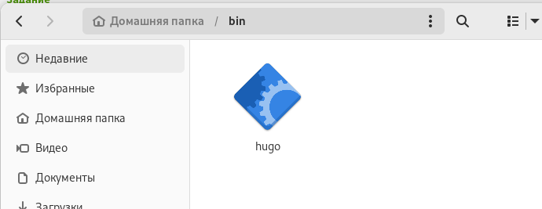{width=70%}

## Выполнение индивидуального проекта

2. Cоздаем репозиторий blog, используя шаблон, и клонируем его 

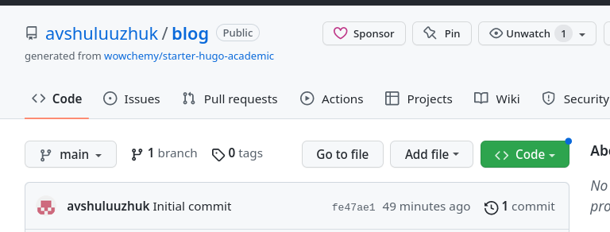{width=60%}

## Выполнение индивидуального проекта

3. Проводим команду ~/bin/hugo server, получаем ссылку на локальный сайт 

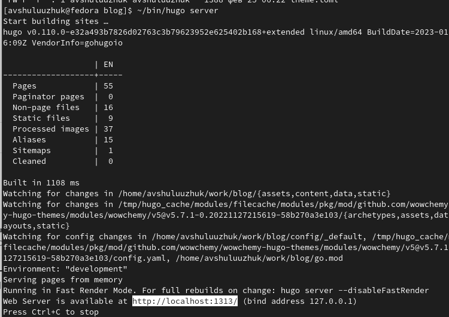{width=60%}

## Выполнение индивидуального проекта

4. Переходим на этот сайт через браузер

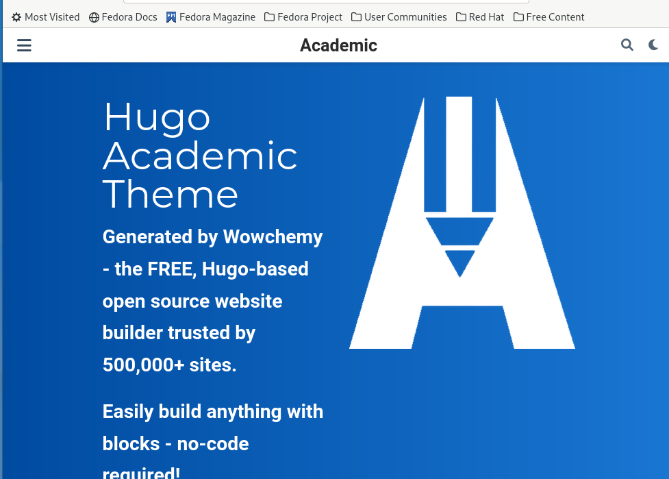{width=50%}

## Выполнение индивидуального проекта

5. Для того, чтобы убрать синий блок с текстом нужно перейти в каталог blog-content-index.md

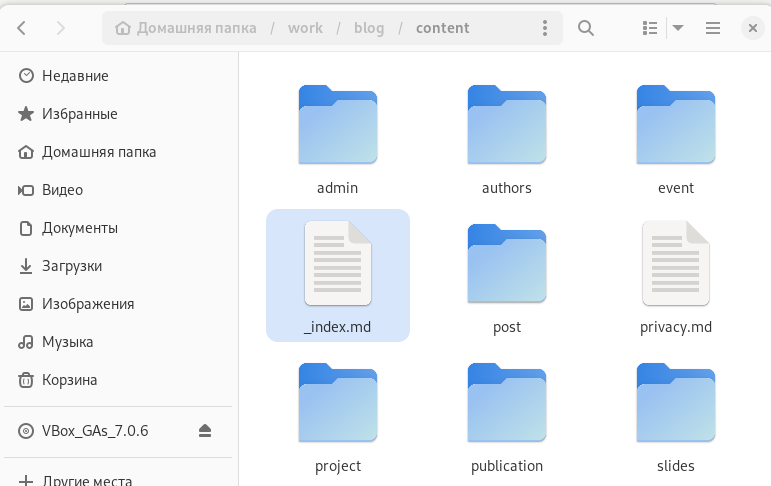{width=50%}

## Выполнение индивидуального проекта

6. В данном файле следует редактировать текст. Удалаяем следующий набор текста

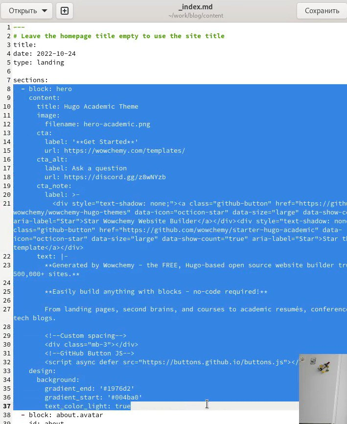{width=40%}

## Выполнение индивидуального проекта

7. После удаления данного текста на сайте сразу исчезнет синий блок

{width=40%}

## Выполнение индивидуального проекта

8. На github создаем еще один новый репозиторий со специальным названием avshuluuzhuk.github.io и клонируем его

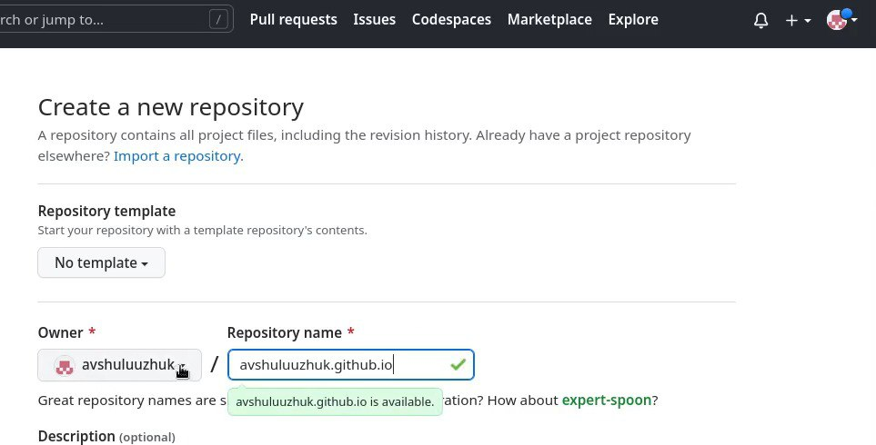{width=70%}

## Выполнение индивидуального проекта

9. В новом каталоге переключаемся на ветку main, создаем пустой файл README.md и отправляем его на github для активации репозитория 

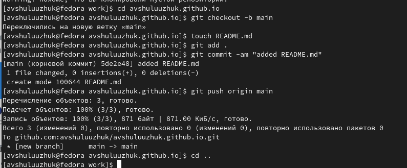{width=70%}

## Выполнение индивидуального проекта

10. Запускаем mc и редактируем .gitignore. Комментируем #public

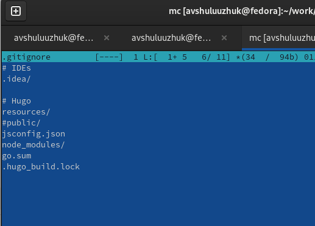{width=50%}

## Выполнение индивидуального проекта

11. Командой "cat .gitignore" проверяем файл и после чего снова повторяем команду для подключения каталога public к репозиторию.

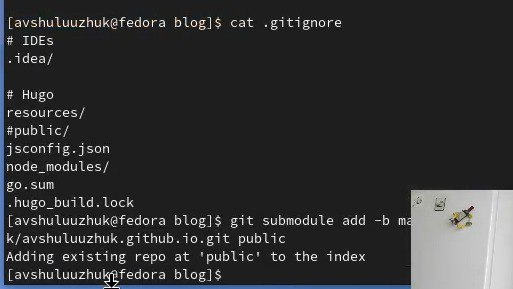{width=60%}

## Выполнение индивидуального проекта

12. Синхронизируем файлы в public с репозиторием. Переходим в public и проверим подключения каталога к репозиторию. После этого отправляем файлы нв сервер

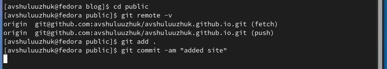{width=70%}

## Выполнение индивидуального проекта

13. Обновляем репозиторий и проверяем добавление файлов

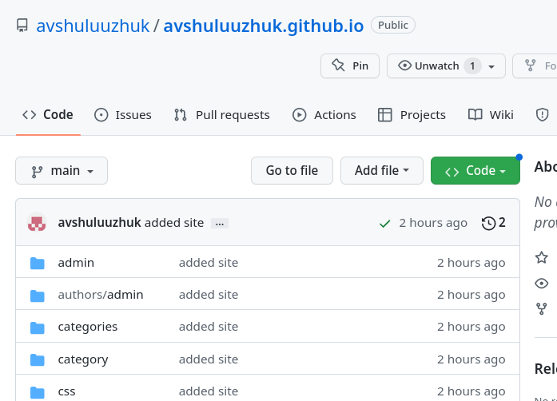{width=50%}

## Выполнение индивидуального проекта

14. Копируем ссылку на новый сайт и переходим на него

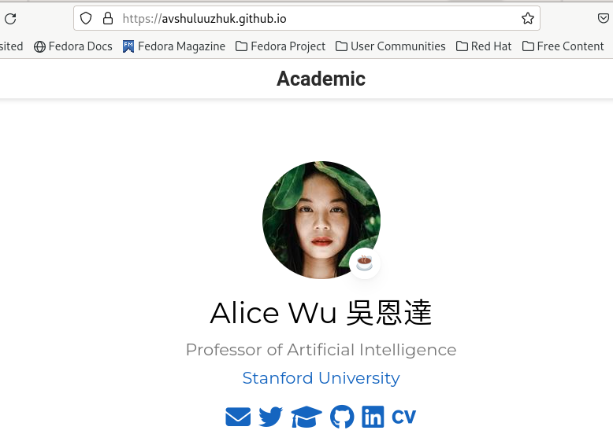{#fig:021 width=50%}

# Выводы

В ходе выполнения первого этапа индивидуального проекта я научилась размещать на github pages заготовки для персонального сайта 

