---
## Front matter
title: "Индивидуальный проект. 1 этап"
subtitle: Операционные системы"
author: "Шулуужук Айраана Вячеславовна НПИбд-02-22"

## Generic otions
lang: ru-RU
toc-title: "Содержание"

## Bibliography
bibliography: bib/cite.bib
csl: pandoc/csl/gost-r-7-0-5-2008-numeric.csl

## Pdf output format
toc: true # Table of contents
toc-depth: 2
lof: true # List of figures
lot: true # List of tables
fontsize: 12pt
linestretch: 1.5
papersize: a4
documentclass: scrreprt
## I18n polyglossia
polyglossia-lang:
  name: russian
  options:
	- spelling=modern
	- babelshorthands=true
polyglossia-otherlangs:
  name: english
## I18n babel
babel-lang: russian
babel-otherlangs: english
## Fonts
mainfont: PT Serif
romanfont: PT Serif
sansfont: PT Sans
monofont: PT Mono
mainfontoptions: Ligatures=TeX
romanfontoptions: Ligatures=TeX
sansfontoptions: Ligatures=TeX,Scale=MatchLowercase
monofontoptions: Scale=MatchLowercase,Scale=0.9
## Biblatex
biblatex: true
biblio-style: "gost-numeric"
biblatexoptions:
  - parentracker=true
  - backend=biber
  - hyperref=auto
  - language=auto
  - autolang=other*
  - citestyle=gost-numeric
## Pandoc-crossref LaTeX customization
figureTitle: "Рис."
tableTitle: "Таблица"
listingTitle: "Листинг"
lofTitle: "Список иллюстраций"
lotTitle: "Список таблиц"
lolTitle: "Листинги"
## Misc options
indent: true
header-includes:
  - \usepackage{indentfirst}
  - \usepackage{float} # keep figures where there are in the text
  - \floatplacement{figure}{H} # keep figures where there are in the text
---

# Цель работы

Размещение на Github pages заготовки для персонального сайта.

# Задание

1. Установить необходимое программное обеспечение.

2. Скачать шаблон темы сайта.

3. Разместить его на хостинге git.

4. Установить параметр для URLs сайта.

5. Разместить заготовку сайта на Github pages.

# Выполнение лабораторной работы

1. Скачиваем архив hugo_extended_0.110.0linux-amd64.tar.gz. (рис. @fig:001)

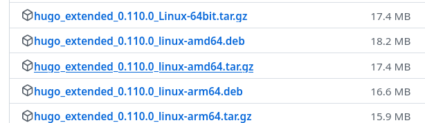{#fig:001 width=70%}

В разделе Загрузки распакуем этот архив и скопируем исполняемый файл hugo. 

В домашнем каталоге создаем папку под названием bin и вставляем в эту папку файл hugo (рис. @fig:002)

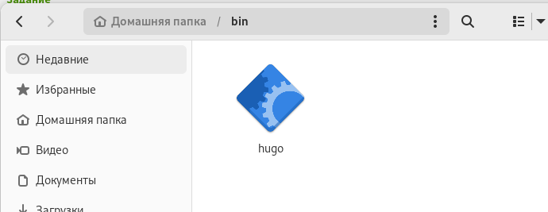{#fig:002 width=70%}

2. Cоздаем репозиторий blog, используя шаблон (рис. @fig:003)

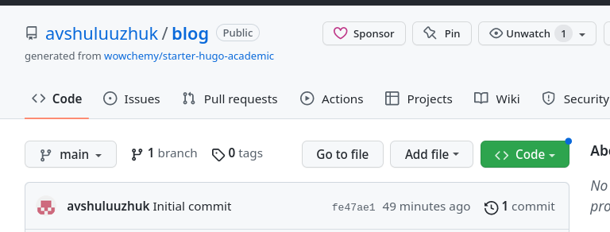{#fig:003 width=70%}

В каталоге work клонируем созданный репозиторий blog  (рис. @fig:004)

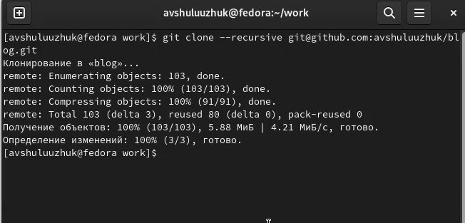{#fig:004 width=70%}

Выполняем команду в каталоге blog (рис. @fig:005)
```
~/bin/hugo 
```
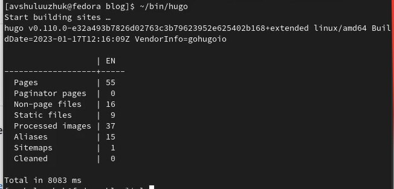{#fig:005 width=70%}

Удаляем каталог public в каталоге blog (рис. @fig:006)

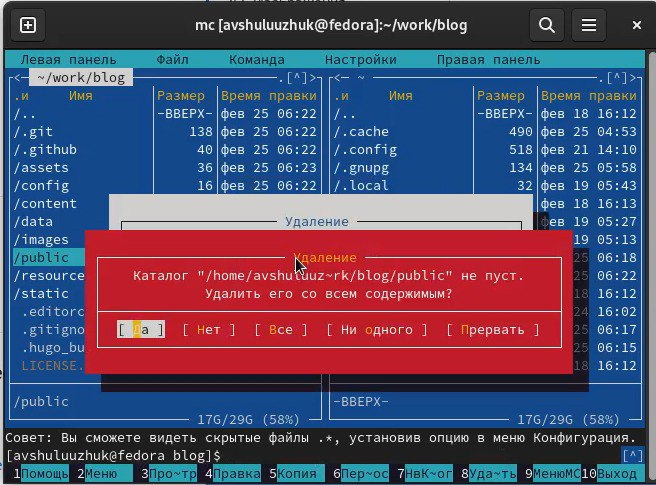{#fig:006 width=70%}

Возвращаемся в терминал и проводим команду ~/bin/hugo server (рис. @fig:007), получаем ссылку на локальный сайт 

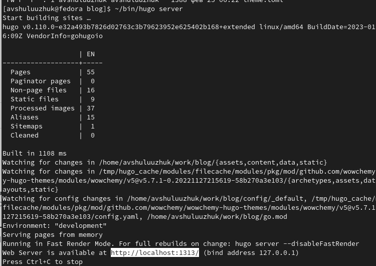{#fig:007 width=70%}

Переходим на этот сайт через браузер (рис. @fig:008)

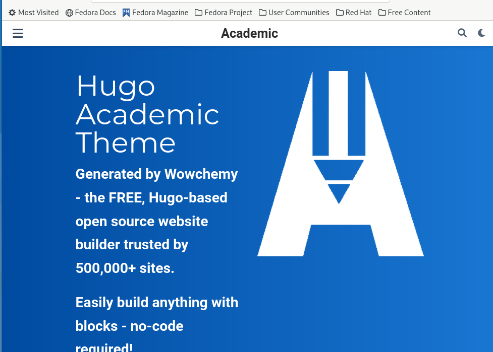{#fig:008 width=70%}

Для того, чтобы убрать синий блок с текстом нужно перейти в каталог blog-content-index.md (рис. @fig:009).

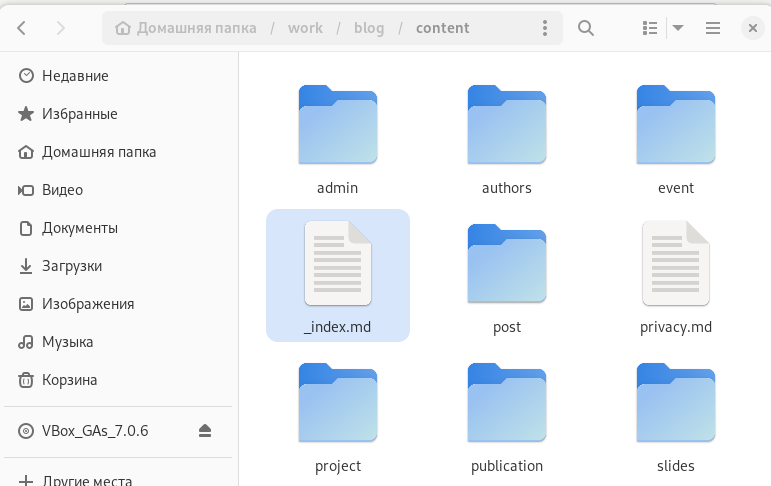{#fig:009 width=70%}

В данном файле следует редактировать текст. Удалаяем следующий набор текста (рис. @fig:010)

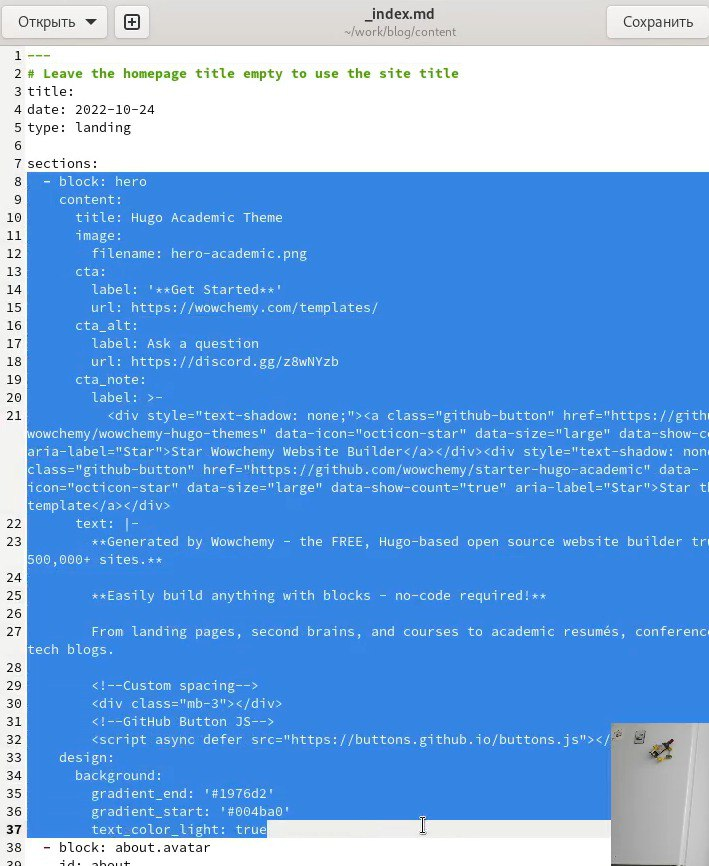{#fig:010 width=70%}

После удаления данного текста на сайте сразу исчезнет синий блок (рис. @fig:011)

{#fig:011 width=70%}

3. На github создаем еще один новый репозиторий со специальным названием avshuluuzhuk.github.io (рис. @fig:012)

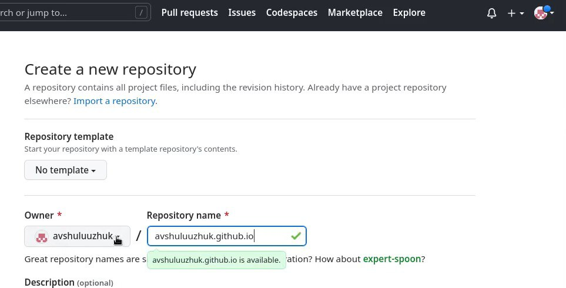{#fig:012 width=70%}

Переходим в каталог work, клонируем новый репозиторий и перейдем в этот каталог  (рис. @fig:013)

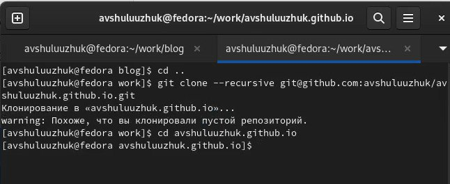{#fig:013 width=70%}

В новом каталоге переключаемся на ветку main, создаем пустой файл README.md и отправляем его на github для активации репозитория (рис. @fig:014)

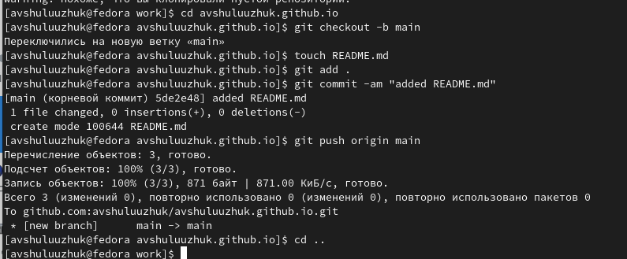{#fig:014 width=70%}

Переходим в каталог blog и выполняем команду для подключения каталога public к созданному репозиторию (рис. @fig:015)

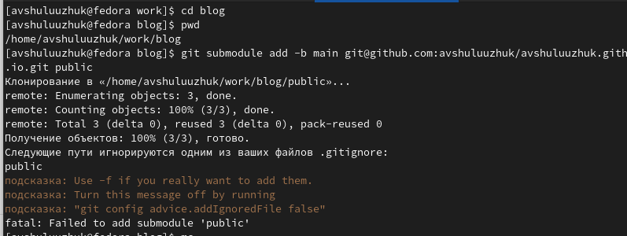{#fig:015 width=70%}

Запускаем mc и редактируем .gitignore. Комментируем #public (рис. @fig:016)

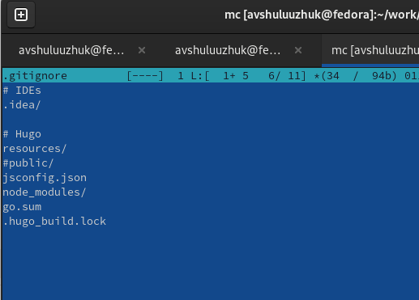{#fig:016 width=70%}

Командой "cat .gitignore" проверяем файл и после чего снова повторяем команду для подключения каталога к репозиторию  (рис. @fig:017)

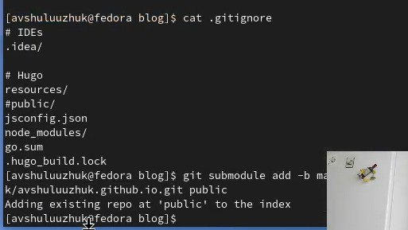{#fig:017 width=70%}

С помощью команды "~/bin/hugo" генерируем автоматически файлы в папку public (рис. @fig:018)

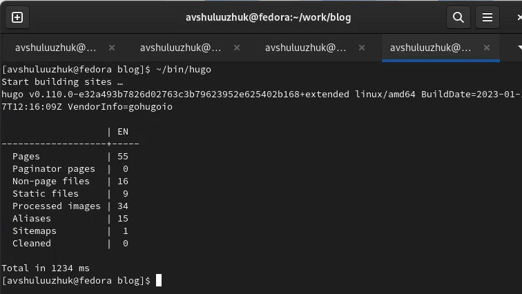{#fig:018 width=70%}

Синхронизируем файлы в public с репозиторием. Переходим в public и проверим подключения каталога к репозиторию. После этого отправляем файлы нв сервер (рис. @fig:019)

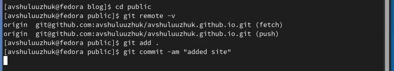{#fig:019 width=70%}

Обновляем репозиторий и проверяем добавление файлов  (рис. @fig:020)

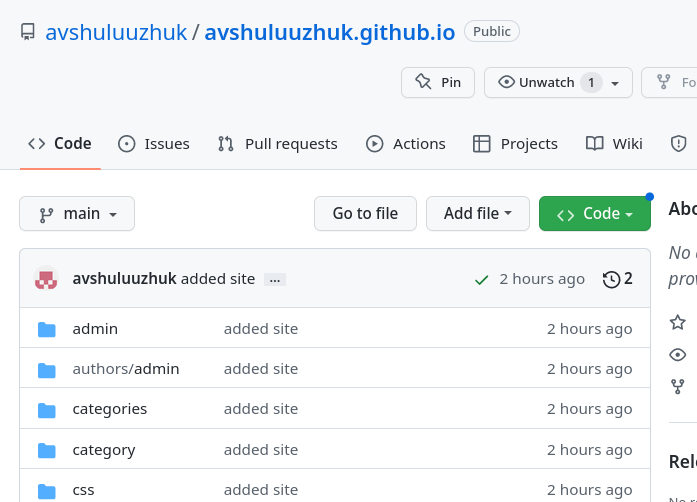{#fig:020 width=70%}

Копируем ссылку на новый сайт и переходим на него  (рис. @fig:021)

{#fig:021 width=70%}

# Выводы

В ходе выполнения первого этапа индивидуального проекта я научилась размещать на github pages заготовки для персонального сайта 

