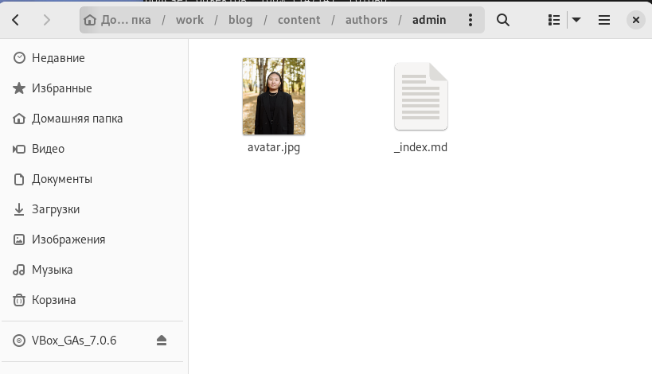
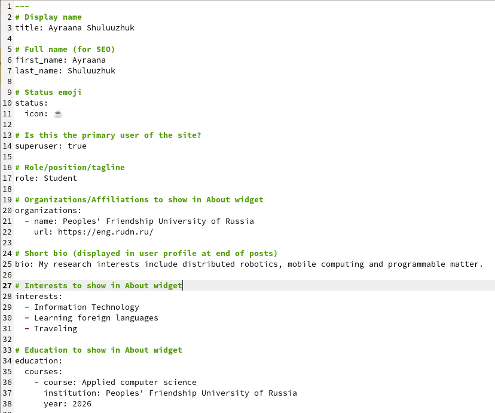
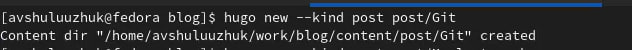
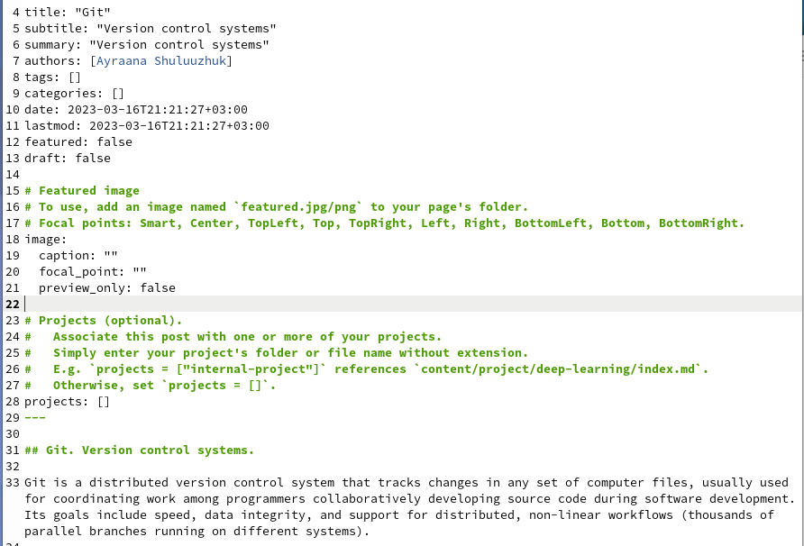
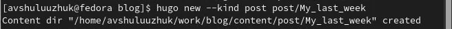
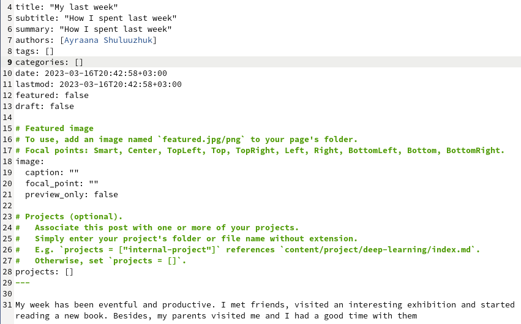
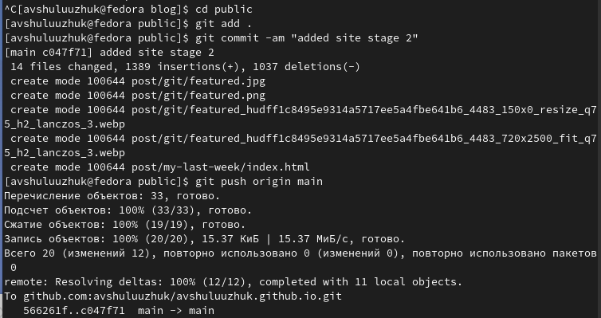
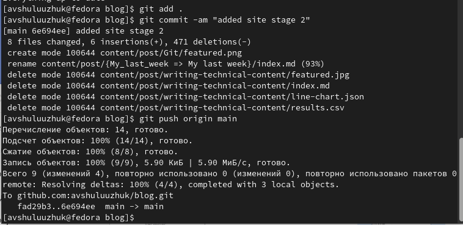
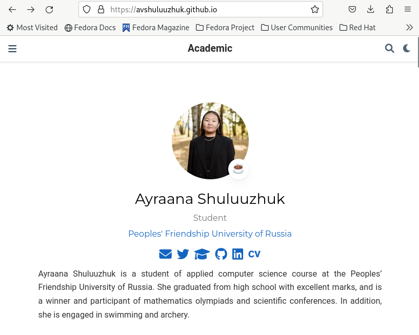
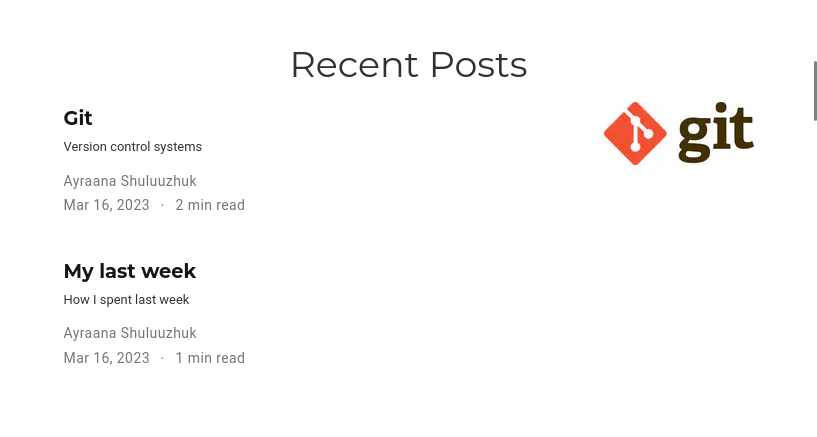

---
## Front matter
lang: ru-RU
title: Индивидуальный проект. 2 этап
subtitle: Операционные системы 
author:
  - Шулуужук Айраана Вячеславовна, НПИбд-02-22
institute:
  - Российский университет дружбы народов, Москва, Россия
 
date: 16 марта 2023

## i18n babel
babel-lang: russian
babel-otherlangs: english

## Formatting pdf
toc: false
toc-title: Содержание
slide_level: 2
aspectratio: 169
section-titles: true
theme: metropolis
header-includes:
 - \metroset{progressbar=frametitle,sectionpage=progressbar,numbering=fraction}
 - '\makeatletter'
 - '\beamer@ignorenonframefalse'
 - '\makeatother'
---

## Докладчик

:::::::::::::: {.columns align=center}
::: {.column width="70%"}

  * Шулуужук Айраана Вячеславовна 
  * НПИбд-02-22
  * 1132221890
  * Российский университет дружбы народов

:::
::: {.column width="30%"}

:::
::::::::::::::

# Цели и задачи

Добавить к сайту данные о себе.

# Выполнение индивидуального проекта

## Добавление фотографии

В каталоге admin добавляем фотографию 

{width=70%}

## Добавление информации о владельце сайта 

Добавим информацию о владельце сайта. В каталоге admin открываем файл index.md и внесем информацию: имя, фамилия, образование, интересы

{width=40%}

## Создание поста Git. Version control systems

Cоздаем пост по теме "Git. Version control systems"

{width=70%}

## Создание поста Git. Version control systems

{width=70%}

## Создание поста по прошедшей неделе

Создаем пост по прошедшей неделе

{width=70%}

## Создание поста по прошедшей неделе

{width=70%}

## Загрузка файлов на сервер

Отправим файлы на Github.

{width=70%}

## Загрузка файлов на сервер

{width=70%}

## Просмотр информации о владельце сайта

Переходим на персональный сайт и просмотрим результат проделанных действий

{width=40%}

## Просмотр созданных постов

Созданные посты 

{width=70%}

# Выводы

В ходе выполнения 2 этапа индивидуального проекта мы добавили информацию о владельце персонального сайта и приобрели практические навыки по созданию новых постов.

