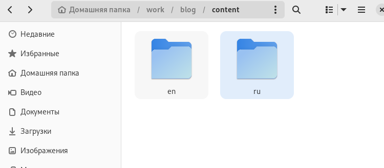
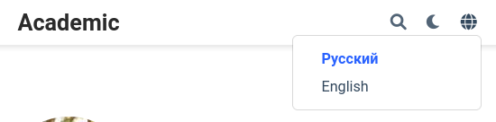
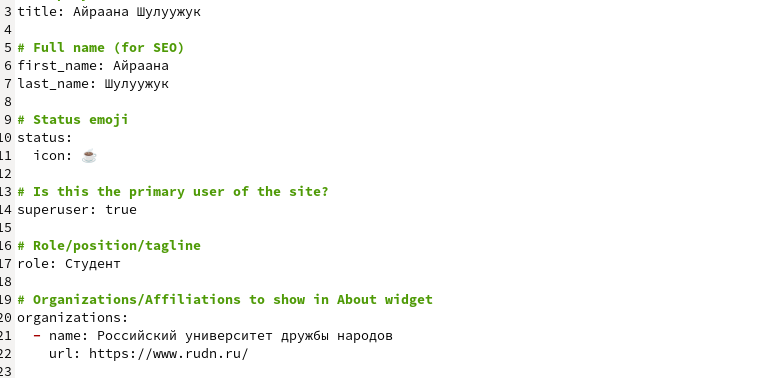
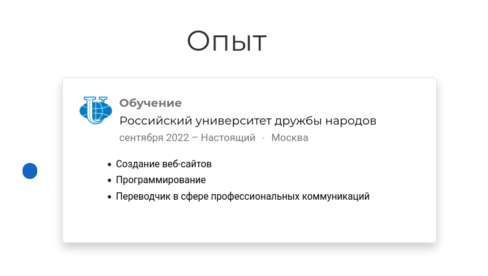
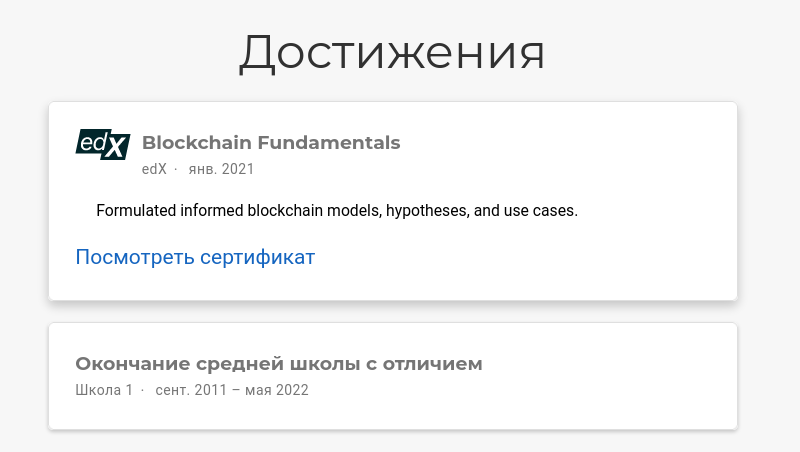
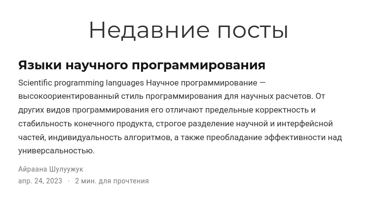
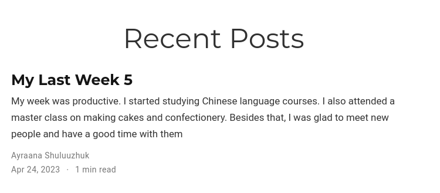
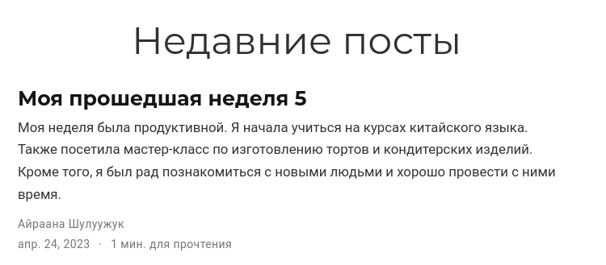
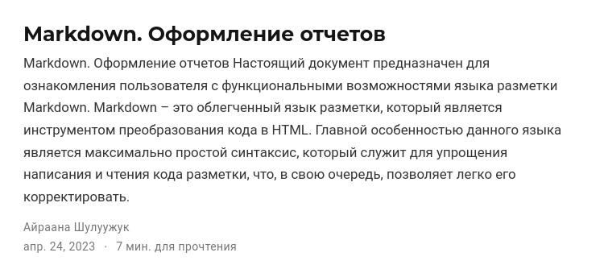

---
## Front matter
title: "Индивидуальный проект. 6 этап"
subtitle: Операционные системы
author: "Шулуужук Айраана Вячеславовна НПИбд-02-22"

## Generic otions
lang: ru-RU
toc-title: "Содержание"

## Bibliography
bibliography: bib/cite.bib
csl: pandoc/csl/gost-r-7-0-5-2008-numeric.csl

## Pdf output format
toc: true # Table of contents
toc-depth: 2
lof: true # List of figures
lot: true # List of tables
fontsize: 12pt
linestretch: 1.5
papersize: a4
documentclass: scrreprt
## I18n polyglossia
polyglossia-lang:
  name: russian
  options:
	- spelling=modern
	- babelshorthands=true
polyglossia-otherlangs:
  name: english
## I18n babel
babel-lang: russian
babel-otherlangs: english
## Fonts
mainfont: PT Serif
romanfont: PT Serif
sansfont: PT Sans
monofont: PT Mono
mainfontoptions: Ligatures=TeX
romanfontoptions: Ligatures=TeX
sansfontoptions: Ligatures=TeX,Scale=MatchLowercase
monofontoptions: Scale=MatchLowercase,Scale=0.9
## Biblatex
biblatex: true
biblio-style: "gost-numeric"
biblatexoptions:
  - parentracker=true
  - backend=biber
  - hyperref=auto
  - language=auto
  - autolang=other*
  - citestyle=gost-numeric
## Pandoc-crossref LaTeX customization
figureTitle: "Рис."
tableTitle: "Таблица"
listingTitle: "Листинг"
lofTitle: "Список иллюстраций"
lotTitle: "Список таблиц"
lolTitle: "Листинги"
## Misc options
indent: true
header-includes:
  - \usepackage{indentfirst}
  - \usepackage{float} # keep figures where there are in the text
  - \floatplacement{figure}{H} # keep figures where there are in the text
---

# Цель работы

Размещение двуязычного сайта на Github.

# Задание

1. Сделать поддержку английского и русского языков.

2. Разместить элементы сайта на обоих языках.

3. Разместить контент на обоих языках.

4. Сделать пост по прошедшей неделе.

5. Добавить пост на тему по выбору (на двух языках).

# Выполнение индивидуального проекта 

Сделаем поддержку сайта на английском и русском языках (рис. @fig:001) (рис. @fig:002)

{#fig:001 width=70%}

{#fig:002 width=70%}

Размеcтим элементы сайта на русском языке (рис. @fig:003) (рис. @fig:004) (рис. @fig:005) (рис. @fig:006)

{#fig:003 width=70%}

{#fig:004 width=70%}

{#fig:005 width=70%}

{#fig:006 width=70%}

Добавим пост по прошедшей неделе на русском и английском языках (рис. @fig:007) (рис. @fig:008)

{#fig:007 width=70%}

{#fig:008 width=70%}

Создадим новый пост по теме "Markdown" (рис. @fig:009)

{#fig:009 width=70%}

# Выводы

В ходе выполнения 6 этапа индивидуального проекта мы разместили персональный сайт на двух языках: английский и русский. Также создали пост по прошедшей неделе на обоих языках и пост по теме "Markdown"

